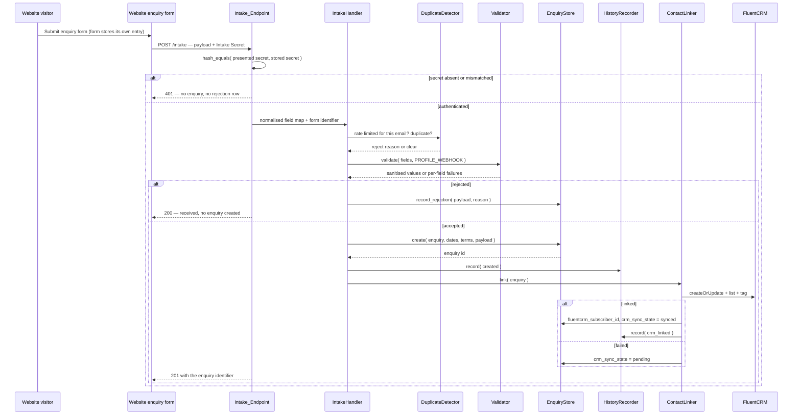
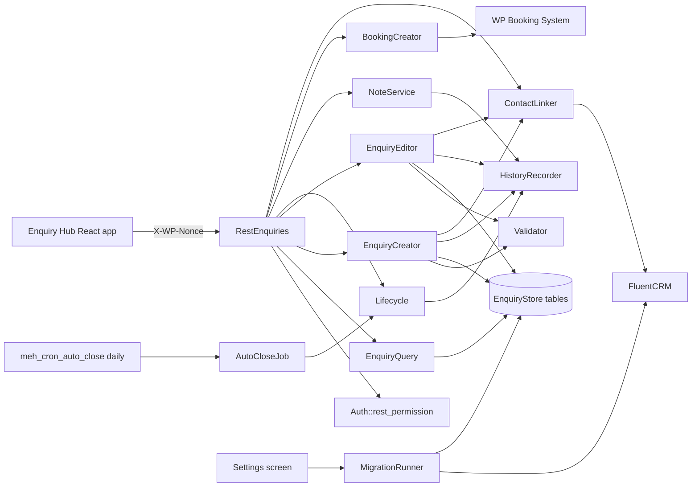

# Design Document

## Overview

This feature moves the source of record for event enquiries out of FluentCRM and into plugin-owned tables. Today `RestEnquiries` reads FluentCRM subscribers in the configured list/tag and stores workflow state in `SubscriberMeta` under `meh_enquiry_status`. That model is contact-centric, so a second enquiry from the same person overwrites the first one's state.

The design introduces an **Enquiry Store**: six tables under the `{$wpdb->prefix}meh_` namespace holding enquiries, candidate dates, multi-select values, notes, history and rejected intake attempts. Intake is a **public REST webhook endpoint**: the live enquiry form posts to it from its Submit Actions, the endpoint authenticates the request against a shared secret, writes the enquiry first, then upserts the FluentCRM contact and records the subscriber id against the enquiry. FluentCRM keeps contact management (record, list, tag, email, automation) and loses all workflow state.

Two authenticated write paths sit alongside intake. The management team can create an enquiry by hand from the hub, for one arriving by telephone or direct email, and can correct the stored field values of any enquiry that is not closed. Both run through the same store-then-link sequence as the webhook, so an enquiry behaves identically whatever created it.

### What changes in the existing plugin

| Area | Today | After this feature |
| --- | --- | --- |
| Enquiry source of record | FluentCRM subscribers + `SubscriberMeta` | `{prefix}meh_enquiries` and related tables |
| Enquiry statuses | `new`, `replied`, `quoted`, `converted`, `closed` | `new`, `contacted`, `quoted`, `converted`, `lost`, `closed` — forward-only, `closed` terminal |
| Intake | Form posts straight into FluentCRM; plugin only reads | Form posts to a public REST webhook endpoint the plugin registers; the endpoint authenticates a shared secret, validates, stores, then links the contact |
| Creating an enquiry by hand | Not possible: an enquiry exists only as a FluentCRM contact the form created | `POST /enquiries` creates one from the hub for a telephone or direct-email enquiry, through the same write path as the webhook |
| Correcting stored details | Not possible: workflow state is the only writable value on the contact | `PATCH /enquiries/{id}` corrects field values, candidate dates and multi-selects on any enquiry that is not closed, leaving the payload snapshot verbatim |
| Cron | All cron cleared (`meh_clear_legacy_cron`) | One daily event, `meh_cron_auto_close`, for auto-closure only |
| Conversion to a booking | `POST /bookings/{id}/convert` on the Event Enquiry calendar hold | `POST /enquiries/{id}/convert` creates the booking from the enquiry record |
| FluentCRM dependency | Hard gate: no features load without FluentCRM Pro | Soft gate: the enquiry layer loads regardless; CRM-dependent pieces degrade |
| Settings | Enquiries (list/tag), Bookings (guest fields + Event Enquiry calendar), Access | Adds Intake (intake secret, nine field mappings, form-identifier payload field) and Migration; drops the Event Enquiry calendar control |

### Design decisions and rationale

**Intake is a webhook, not an in-process form hook.** The form's Submit Actions post an HTTP request to a public REST route the plugin owns. A single HTTP entry point removes the coupling to any form plugin's internal hook signature entirely: nothing in the plugin needs to know how a given form block version shapes its submission arguments, or which action name that version fires. It is testable with a plain HTTP request — no form plugin, no WordPress request lifecycle, no fixtures imitating a third party's hook payload — and it accepts submissions from non-WordPress front ends, which the in-process route could never do. Requirement 2.12 is satisfied by configuration (field mappings plus label matching) rather than by code per form plugin.

**What the webhook costs, and how the design answers it.** Four tradeoffs come with moving intake onto a public HTTP surface, and each has a specific answer here.

- *The endpoint is public.* It must accept requests carrying no WordPress user (Requirement 16.8), so it cannot use `Auth::rest_permission`. Authentication is a shared secret held in Settings, compared with `hash_equals()` so comparison time does not depend on where the first differing character falls (Requirement 16.10). A failed comparison returns 401 and stops before any other work.
- *The request is server-to-server.* The client IP on the request is the site's own IP — every submission looks like the same client — so IP-keyed rate limiting would either throttle all enquiries together or do nothing. Rate limiting therefore keys on the submitted email address instead (Requirements 4.6, 4.7).
- *The form supplies no spam verdict.* An in-process hook could read the form plugin's own spam determination; a webhook body carries no such field. The `spam` rejection reason is gone, and the rejection reasons are exactly `duplicate`, `rate_limited`, `validation` and `storage` (Requirement 4.1).
- *The form delivers once and does not retry.* There is no second delivery to fall back on, so an unrecoverable receipt failure must leave a trace: every authenticated request that produces no enquiry is written to the rejections table with its payload, reason and receipt time (Requirement 5.8), and the form plugin's own stored entry is the backstop for recreating the enquiry by hand.

**One validator with a required-field profile, not two validators.** A webhook submission must carry all nine fields; a manual submission or an edit must carry only `first_name`, `last_name`, `email` and `selected_dates` (Requirements 3.14, 3.15). That is the *only* difference between the two cases. Every per-field value rule — email well-formedness, `total_guests` within 1–10000, 1 to 10 parseable candidate dates, `phone` containing at least one digit, `event_type` and `site_exclusivity` inside their vocabularies — is identical on both paths, as is the HTML stripping and the truncation. Two validator classes would therefore duplicate all the interesting logic and diverge the moment one is changed. `Validator::validate( $fields, $profile )` takes the profile as an argument and consults `PROFILE_WEBHOOK` or `PROFILE_MANUAL` for the required set only.

What makes the optional fields work is that a value rule fires **only when its field is present and holds a value that is non-empty after trimming** (Requirement 3.17). Presence is checked first, against the profile's required set; the value rules then run over whatever is present and non-empty. So an absent `total_guests` under the Manual profile produces no failure at all, while a `total_guests` of `"0"` under either profile fails the range rule. Emptiness is one predicate — key absent, empty string, whitespace-only, or empty collection — used both by the presence check and by the value-rule gate, so the two can never disagree about what "empty" means (Requirement 3.16).

**Manual creation reuses the webhook write path.** Requirement 18 asks for the same resilience, staging marking and history behaviour as intake. If the manual route wrote its own inserts, those three behaviours would exist twice and drift apart at the first change — a new history entry added to one path and not the other, or a store-then-link ordering fixed in one place only. So both paths converge on one `EnquiryCreator::create()` that runs the single store-then-link sequence: validate → store enquiry, dates, terms and payload snapshot inside one transaction → record `created` history → link the contact, downgrading to `crm_sync_state = pending` on failure.

Exactly four things differ between the two callers, and they are all parameters of that one call:

| Difference | Intake webhook | Manual route |
| --- | --- | --- |
| Validation profile | `PROFILE_WEBHOOK` — all nine required | `PROFILE_MANUAL` — four required (Requirement 18.2) |
| `source` value | `webhook:{form id}` or `webhook:unidentified` | `manual:{user id}` (Requirement 18.8) |
| History attribution | `actor_id = 0`, the system | the submitting user's identifier (Requirement 18.18) |
| Duplicate and rate-limit guards | both run | **neither runs** (Requirement 18.12) |

The guards are deliberately scoped to intake alone. They exist to absorb a public form being submitted twice by an impatient visitor, or hammered; a manual request comes from a named, authenticated staff member who has decided this is a real enquiry, so a second identical creation within the window is a legitimate second enquiry (Requirements 18.13, 18.14). A repeat enquirer is surfaced instead by the same-email sibling summary the single-enquiry route already returns. `EnquiryCreator` therefore takes a `guards` flag rather than calling `DuplicateDetector` unconditionally, and the manual route also writes no rejection row for any outcome (Requirement 18.15) — rejection rows exist to make an unattended, non-retried webhook recoverable, and an authenticated caller gets a 400 in the response instead.

**An edit corrects the stored values and never the snapshot.** The payload snapshot is the audit trail: it is what arrived, verbatim, and its value comes entirely from being unalterable (Requirement 19.11). An edit therefore writes only the stored columns and the child rows, and the immutable set on the edit path is `status`, `status_changed_at`, `created_at`, `source`, `is_test`, `booking_id` and `payload` (Requirement 19.9). This also means the pair (snapshot, stored values) answers "what did they actually say?" and "what do we believe now?" separately, which is the reason a correction does not need to be modelled as a duplicate-and-supersede.

**The FluentCRM dependency gate becomes soft.** `meh_bootstrap()` currently returns early when FluentCRM Pro is absent, so nothing loads. Requirement 5 says an enquiry must be captured even when contact linkage fails, and Requirement 6.7 says an inactive FluentCRM produces a linkage failure rather than a lost enquiry. Those cannot hold if the intake handler never loads. The bootstrap therefore loads the Enquiry Store, intake, lifecycle and REST layers unconditionally, and only `ContactLinker` and `MigrationRunner` check FluentCRM availability at call time. The existing admin notice is kept but downgraded from "features disabled" to "contact linkage disabled".

**Schema upgrades run on load, not only on activation.** Deployment is an SFTP file mirror (see the GitHub Actions workflows); the plugin is never re-activated on deploy. Activation alone would never run migrations. `Schema::maybe_upgrade()` therefore runs on `plugins_loaded`, guarded by an option comparison so a matched version executes no SQL at all.

**Multi-select values share one table.** `event_type` and `site_exclusivity` are both "one row per selected value, related to one enquiry" (Requirement 1.3). A single `meh_enquiry_terms` table with a `taxonomy` discriminator satisfies both and keeps the table count down, at the cost of a slightly wider index.

**Filter-to-SQL translation is a pure function.** The list endpoint has to combine up to seven filters, be order-independent across parameter sets (Requirement 12.13) and bind every submitted value (Requirement 3.10). `EnquiryQuery` takes a normalised argument array and returns `[ $where_sql, $bindings, $order_sql, $limit_sql ]` without touching `$wpdb`, so the whole filter matrix is testable without a database.

**No uninstall handler is added.** Requirement 1.14 says enquiry data survives uninstall. The plugin has no `uninstall.php` today and this feature does not add one; `Schema` exposes no public drop method. Removing test records is a separate, explicit, capability-gated route.

**WPBS side effects stay suppressed.** `BookingCreator` reuses the approach already proven in `BookingConverter`: `wpbs_insert_booking()` plus `wpbs_insert_event()` against the target calendar's `booked` legend item, never the WPBS form flow. The date-blocking and legend-lookup helpers move from `BookingConverter` into `SourceWpbs` so both callers share one implementation, and `class-booking-converter.php` plus `POST /bookings/{id}/convert` are retired with the Event Enquiry calendar flow.

### Research notes

- **Kadence webhook Submit Action.** Kadence Blocks' Advanced Form offers a Webhook option configured under the form's Submit Actions, where a destination URL is supplied and the submitted fields are posted to it — see [Kadence form webhooks](https://www.liquidweb.com/help-docs/software/kadence/form-integrations/webhooks-2/). Content was rephrased for compliance with licensing restrictions. This is the intake path: the destination URL is the plugin's REST intake route.
- **Open verification item: does the Kadence webhook action support custom request headers?** This could not be confirmed from the vendor documentation. The consequence matters, because it decides how the shared secret travels. The design therefore does not depend on the answer: the endpoint reads the secret from a request header when one is present and falls back to a query parameter when it is not (Requirements 16.14, 16.15). The fallback is deliberately the weaker of the two — a secret in the request URL is written into server access logs, and into any proxy or CDN log in front of the site, where a secret in a header is not — so the Settings screen states that weakness next to the control, and the header transport is used wherever the form supports it. Confirming header support on the live Kadence version, before go-live, is a task rather than a design question.
- **FluentCRM contact upsert.** `FluentCrmApi( 'contacts' )->createOrUpdate( $data )` matches on email and returns the subscriber model, which is the upsert primitive Requirement 6 needs. `SubscriberNote` is read (not written) by the migration.
- **Property-based testing in PHP.** [Eris](https://github.com/giorgiosironi/eris) is the QuickCheck port for the PHP/PHPUnit ecosystem and is the library chosen here. Content rephrased for compliance with licensing restrictions.

## Architecture

### Intake path



Authentication comes first: a request whose secret is absent or does not match is answered 401 and nothing else happens — no enquiry, no rejection row, no log of the payload (Requirement 16.11). After that, the ordering is the resilience guarantee: the store write precedes every CRM call, so a CRM fault can only downgrade an enquiry to `crm_sync_state = pending`, never lose it. The endpoint catches its own throwables, answers 500 and leaves no partial rows (Requirement 5.7); because the visitor's submission completed before the request was sent, that failure is invisible to them.

### Read and management path



`Lifecycle` is the single writer of `status` and `status_changed_at`. `AutoCloseJob` closes enquiries by calling `Lifecycle::transition()` rather than writing rows itself, which is what makes Requirement 8.4 hold and gives auto-closure the same history and hook behaviour as a manual change.

### File layout

New and changed files follow the existing `includes/class-*.php` + `\MarthrownEnquiryHub\ClassName` convention, static methods, `init()` for anything that registers hooks.

```
marthrown-enquiry-hub/
├── marthrown-enquiry-hub.php            # CHANGED: soft dependency gate, schema boot, cron
├── includes/
│   ├── class-schema.php                 # NEW  Schema_Manager
│   ├── class-enquiry-store.php          # NEW  Enquiry_Store (writes + reads)
│   ├── class-enquiry-query.php          # NEW  pure filter -> SQL builder
│   ├── class-enquiry-validator.php      # NEW  Validator
│   ├── class-intake-endpoint.php        # NEW  Intake_Endpoint (REST route + secret auth)
│   ├── class-intake-handler.php         # NEW  Intake_Handler (authenticated payload -> enquiry)
│   ├── class-enquiry-creator.php        # NEW  shared create path: webhook + manual
│   ├── class-enquiry-editor.php         # NEW  field correction path (Requirement 19)
│   ├── class-field-mapper.php           # NEW  mapping + label fallback resolution
│   ├── class-duplicate-detector.php     # NEW  Duplicate_Detector (+ rate limit)
│   ├── class-contact-linker.php         # NEW  Contact_Linker
│   ├── class-lifecycle.php              # NEW  Lifecycle_Manager
│   ├── class-auto-close-job.php         # NEW  Auto_Close_Job
│   ├── class-note-service.php           # NEW  Note_Service
│   ├── class-history-recorder.php       # NEW  History_Recorder
│   ├── class-booking-creator.php        # NEW  Booking_Creator (enquiry -> WPBS booking)
│   ├── class-migration-runner.php       # NEW  Migration_Runner
│   ├── class-staging-marker.php         # NEW  Staging_Marker
│   ├── class-rest-enquiries.php         # REWRITTEN: reads the store, full route set
│   ├── class-settings.php               # CHANGED: Intake + Migration sections
│   ├── class-source-wpbs.php            # CHANGED: hosts shared legend/date-block helpers
│   ├── class-rest-bookings.php          # CHANGED: convert route removed
│   ├── class-booking-converter.php      # REMOVED
│   └── … unchanged (auth, calendar-reader, admin-page, wpbs-banner, frontend-bookings, export)
└── src/
    ├── api.js                           # CHANGED: new enquiry endpoints
    └── components/
        ├── EnquiryManager.js            # CHANGED: six statuses, test badge, hide-test toggle, new-enquiry control
        ├── EnquiryDetail.js             # NEW  single-enquiry panel + edit control
        ├── EnquiryForm.js               # NEW  shared create/edit form (Requirements 18.23, 19.20)
        ├── EnquiryFilters.js            # CHANGED: candidate-date range, hide-test
        └── BookingsManager.js           # CHANGED: convert control removed
```

### Bootstrap sequence

```php
// marthrown-enquiry-hub.php
define( 'MEH_DB_VERSION', 1 );

register_activation_hook( __FILE__, 'meh_activate' );    // schema install + cron schedule + rewrite
register_deactivation_hook( __FILE__, 'meh_deactivate' ); // cron clear only; tables retained

function meh_bootstrap() {
    // Always: the enquiry layer does not depend on FluentCRM.
    require_once MEH_INCLUDES_DIR . 'class-schema.php';
    Schema::maybe_upgrade();          // no SQL when version matches
    // … requires …
    Schema::init(); StagingMarker::init(); IntakeEndpoint::init(); AutoCloseJob::init();
    RestEnquiries::init(); RestBookings::init(); Settings::init(); /* … UI … */

    if ( ! meh_is_fluentcrm_pro_active() ) {
        add_action( 'admin_notices', 'meh_missing_dependency_notice' ); // reworded
    }
}
add_action( 'plugins_loaded', 'meh_bootstrap' );
```

`meh_clear_legacy_cron()` keeps clearing `meh_cron_email_poll` and `meh_cron_wpbs_poll`, and `meh_deactivate()` additionally clears `meh_cron_auto_close`.

## Components and Interfaces

All classes live in `\MarthrownEnquiryHub`. Failures use `WP_Error` with an HTTP `status` in the error data, matching `BookingConverter` and `RestEnquiries` today.

### Schema (Schema_Manager)

```php
class Schema {
    const VERSION_OPTION = 'meh_db_version';
    const CURRENT_VERSION = 1;

    public static function init();                       // hooks nothing beyond the upgrade guard
    public static function table( string $key ): string;  // 'enquiries' -> wp_meh_enquiries
    public static function install(): bool;               // dbDelta all tables; idempotent
    public static function maybe_upgrade(): bool;         // no-op when stored == CURRENT_VERSION
    protected static function migrations(): array;        // [ version => callable ]
    public static function stored_version(): int;
}
```

`install()` is `dbDelta()`-based, so re-running it against existing tables issues no destructive statement. `maybe_upgrade()` reads the option first and returns before any `$wpdb` call when it equals `CURRENT_VERSION`. Each migration callable returns `true`/`false`; on `false` or a non-empty `$wpdb->last_error`, the version option is left untouched and the failure is logged with the table name and reason.

### EnquiryStore (Enquiry_Store)

```php
class EnquiryStore {
    // Writes
    public static function create( array $enquiry, array $dates, array $terms, array $payload );  // int|WP_Error
    public static function update_fields( int $id, array $fields );                              // bool|WP_Error  (single-column writes: booking_id, crm_sync_state, …)
    /**
     * Partial correction of an enquiry: scalar fields, candidate dates, terms.
     * @param array $fields  subset of first_name,last_name,email,phone,total_guests,message
     * @param array|null $dates  replacement candidate-date set, or null to leave the set alone
     * @param array|null $terms  replacement term sets keyed by taxonomy, or null per taxonomy to leave it alone
     * @return array{changed:array<string,array{from:mixed,to:mixed}>}|WP_Error
     */
    public static function update( int $id, array $fields, ?array $dates = null, ?array $terms = null );
    public static function duplicate( int $source_id );                                          // int|WP_Error
    public static function delete_test_records(): int;
    public static function record_rejection( array $payload, string $reason, array $detail = array() ): int;

    // Reads
    public static function find( int $id );                        // array|null  (hydrated, with dates/terms)
    public static function query( array $args ): array;            // { items, total, counts }
    public static function status_counts( array $args ): array;
    public static function siblings_by_email( string $email, int $exclude_id ): array;
    public static function settled_before( string $datetime ): array;  // ids for AutoCloseJob
    public static function rejections( array $args ): array;
}
```

`create()` wraps its inserts in `START TRANSACTION` / `COMMIT` where the storage engine supports it, and on any child-row failure deletes the parent row and returns a `WP_Error`, so a partial enquiry is never visible. `duplicate()` uses the same all-or-nothing rule and only writes the `duplicated_from_id` / `duplicated_to_id` pair after every copy step succeeds.

`update()` is the correction primitive behind Requirement 19, and it does three things the simpler `update_fields()` does not:

- **Partial.** Only the keys present in `$fields` are written; a key absent from `$fields` leaves its stored value alone (Requirement 19.7). `$dates` and `$terms` are nullable for the same reason — `null` means "not submitted, leave the set as it is", an array means "replace the set with exactly this". Candidate dates and terms are replaced wholesale rather than diffed, because both are sets with no identity of their own.
- **Transactional and all-or-nothing.** The scalar write, the date replacement and each taxonomy's term replacement run in one transaction. Any failure rolls back (or, without transaction support, restores the deleted child rows from the set read before the write) and returns `WP_Error`, so a rejected or failed edit leaves every stored value of that enquiry as it was (Requirements 19.4, 19.5).
- **Reports what actually changed.** The return value is a `changed` map, `field => [ from, to ]`, computed by comparing each submitted value against the value already stored and covering the date and term sets as set comparisons. The caller uses it to decide whether to touch `updated_at` (Requirement 19.8), whether to write a `fields_edited` history entry and what to put in it (Requirement 19.13), and whether a re-link is needed (Requirement 19.14). It never writes `status`, `status_changed_at`, `created_at`, `source`, `is_test`, `booking_id` or `payload` (Requirement 19.9).

The no-op case falls out of the same comparison: when every submitted value already equals the stored value, `changed` is empty, and `update()` issues no write at all — not an `UPDATE` setting a column to its own value — so `updated_at` is untouched and the caller records no history (Requirement 19.18).

### EnquiryQuery (pure)

```php
class EnquiryQuery {
    /**
     * @param array $args status, s, from, to, date_from, date_to, hide_test, page, per_page, orderby, order
     * @return array{where:string, bindings:array, order:string, limit:string, warnings:array}
     */
    public static function build( array $args ): array;
    public static function normalise( array $args ): array;   // defaults, per_page cap, canonical key order
}
```

`normalise()` sorts and canonicalises the argument set, which is what makes two differently-ordered parameter sets produce identical SQL. Every value goes into `bindings` for `$wpdb->prepare()`; no submitted value is concatenated into SQL. A lone `date_from` or `date_to` produces no candidate-date join and adds a warning naming the missing parameter.

### IntakeEndpoint (Intake_Endpoint)

```php
class IntakeEndpoint {
    const ROUTE          = '/intake';                 // marthrown-enquiry-hub/v1/intake, POST
    const SECRET_OPTION  = 'meh_intake_secret';
    const SECRET_HEADER  = 'X-MEH-Intake-Secret';
    const SECRET_QUERY   = 'meh_secret';

    public static function init();                                   // rest_api_init -> register_routes
    public static function register_routes();
    public static function authenticate( \WP_REST_Request $r );      // true|WP_Error( 401 )
    public static function handle( \WP_REST_Request $r );            // WP_REST_Response
    public static function normalise( \WP_REST_Request $r ): array;  // flat field key => value
    protected static function presented_secret( \WP_REST_Request $r ): string;
}
```

One route: `POST marthrown-enquiry-hub/v1/intake`. Its `permission_callback` is `self::authenticate`, which is the only permission callback in the namespace other than `Auth::rest_permission` (Requirement 16.9) and the reason the route works for a caller with no WordPress user (Requirement 16.8).

`presented_secret()` resolves the secret **header first, query parameter second**: the `X-MEH-Intake-Secret` header when the request carries it, otherwise the `meh_secret` query parameter. Both transports are supported because header support in the sending form's webhook action is unconfirmed (Requirements 16.14, 16.15); the query route is the documented fallback and the Settings screen states its access-log weakness.

`authenticate()` compares the presented value against the stored secret with `hash_equals()` (Requirement 16.10) and returns `WP_Error( 'meh_intake_unauthorized', …, [ 'status' => 401 ] )` when the secret is absent or does not match. Because it is a permission callback it runs before `handle()`, so an unauthenticated request creates no enquiry and no rejection row and is not logged with its payload (Requirement 16.11). No response from any route in the namespace carries the secret value in its body or headers (Requirement 16.12).

`normalise()` does the work the per-form-plugin adapters used to do, once, for every sender: it takes the request body — JSON or form-encoded — flattens it to a `field key => value` map, decodes a `selected_dates`, `event_type` or `site_exclusivity` value delivered as a delimited string into an array, and reads the form identifier from the payload field named in Settings. That identifier becomes `source`; when the payload carries no such field, `source` is the fixed value `webhook:unidentified` (Requirement 2.4). Nothing in `normalise()` is specific to a form plugin, which is what Requirement 2.12 asks for.

### IntakeHandler (Intake_Handler)

```php
class IntakeHandler {
    /** @return array{created:bool, enquiry_id:int, reason:string, errors:array} */
    public static function receive( array $fields, string $source, string $received_at ): array;
}
```

Order of work on an authenticated request: rate limit by submitted email → duplicate check (email plus candidate-date set within the window) → validate → store the enquiry, dates, terms and payload snapshot → record `created` history → link the contact. There is no spam check: a webhook body carries no spam verdict, so that branch does not exist and `spam` is not a rejection reason. Any outcome other than a created enquiry writes one rejection row carrying the payload, the reason and the receipt time (Requirements 4.1, 5.8), and `receive()` reports which happened so the endpoint can choose its status code.

Everything from "validate" onward is `EnquiryCreator::create()`, not `IntakeHandler`'s own code. `IntakeHandler` keeps only what is webhook-specific: running the two guards, choosing the Webhook profile, deriving `source` from the form identifier, and writing the rejection row.

### EnquiryCreator

```php
class EnquiryCreator {
    /**
     * The single store-then-link sequence. Shared by IntakeHandler and the manual route.
     *
     * @param array  $fields    raw submitted field map
     * @param string $profile   Validator::PROFILE_WEBHOOK | Validator::PROFILE_MANUAL
     * @param string $source    'webhook:{form id}' | 'webhook:unidentified' | 'manual:{user id}'
     * @param string $at        receipt time, site timezone
     * @param int    $actor     history attribution: 0 for the system, user id for a manual request
     * @return array{created:bool, enquiry_id:int, errors:array<string,string>, crm_sync_state:string}
     */
    public static function create( array $fields, string $profile, string $source, string $at, int $actor ): array;
}
```

`create()` is the whole of the write path both callers share: validate under the given profile → `EnquiryStore::create()` with the enquiry row, the candidate dates, the terms and the payload snapshot in one transaction → `is_test` from `StagingMarker` → `HistoryRecorder::record( 'created', …, $actor )` → `ContactLinker::link()`, setting `crm_sync_state` to `synced` or `pending`. It runs no guard and writes no rejection row; both of those belong to the caller, which is what confines the webhook-only behaviour to `IntakeHandler` (Requirement 18.12).

`created_at`, `updated_at` and `status_changed_at` are all set to `$at`, and `status` to `new`, for either caller (Requirements 2.1, 2.2, 18.7, 18.9). The manual route passes the time the REST request was received; intake passes the time the webhook was received.

### Manual creation route handling

`RestEnquiries::create_enquiry()` is thin by design:

```php
$fields = self::read_fields( $request );                  // sanitised args, dates/terms as arrays
$result = EnquiryCreator::create(
    $fields,
    Validator::PROFILE_MANUAL,                            // Requirement 18.2
    'manual:' . get_current_user_id(),                    // Requirement 18.8
    Clock::now(),                                         // Requirement 18.9
    get_current_user_id()                                 // Requirement 18.18
);
return $result['created']
    ? new \WP_REST_Response( self::represent( $result['enquiry_id'] ), 201 )
    : new \WP_Error( 'meh_invalid_enquiry', …, array( 'status' => 400, 'errors' => $result['errors'] ) );
```

No `DuplicateDetector` call and no `record_rejection()` call appear on this path at all (Requirements 18.12, 18.13, 18.14, 18.15) — their absence is the design, not an omission, and the property tests assert it. `is_test`, staging name prefixing and the `test-record` tag come from the shared path, so a manually created enquiry is marked in staging exactly as a webhook one is (Requirements 18.17, 18.19, 18.20).

### EnquiryEditor

```php
class EnquiryEditor {
    /** @return array{changed:array<string,array{from:mixed,to:mixed}>, crm_sync_state:string}|WP_Error */
    public static function apply( int $enquiry_id, array $fields, int $actor );
}
```

Order of work:

1. `RestEnquiries::guard_writable( $id )` — 404 for an unknown identifier, 409 for `status === 'closed'`, before anything is read or validated (Requirements 9.1, 19.12).
2. `Validator::validate( $fields, Validator::PROFILE_MANUAL, self::MODE_PARTIAL )` over the fields present in the request, returning 400 with every failing field named and nothing written (Requirements 19.3, 19.4, 19.5). Accepted values arrive HTML-stripped and truncated (Requirement 19.6).
3. `EnquiryStore::update( $id, $fields, $dates, $terms )` — partial, transactional, returning the `changed` map (Requirements 19.7, 19.9).
4. When `changed` is empty: return, having written nothing. `updated_at` is untouched and no history entry exists (Requirement 19.18).
5. When `changed` is non-empty: set `updated_at` to the request time (Requirement 19.8), record one `fields_edited` history entry carrying the `changed` map and `$actor` (Requirement 19.13), then `ContactLinker::relink( $id, $changed )` (Requirements 19.14–19.17).

Steps 4 and 5 are the reason `update()` returns the `changed` map rather than a boolean: three separate decisions — timestamp, history, re-link — all key off the same answer, and computing it once in the store is what keeps them consistent. The editor accepts an enquiry of any `source`, webhook, manual or migration alike (Requirement 19.2); nothing on this path reads `source`.

### Validator

```php
class Validator {
    const PROFILE_WEBHOOK = 'webhook';
    const PROFILE_MANUAL  = 'manual';

    /** Required-field sets — the only thing a profile decides. */
    const REQUIRED_BY_PROFILE = array(
        // Webhook Validation Profile: all nine fields required (Requirement 3.14).
        self::PROFILE_WEBHOOK => array( 'first_name','last_name','email','phone','total_guests','selected_dates','event_type','site_exclusivity','message' ),
        // Manual Validation Profile: four required; phone, total_guests, message,
        // event_type and site_exclusivity optional (Requirement 3.15).
        self::PROFILE_MANUAL  => array( 'first_name','last_name','email','selected_dates' ),
    );
    const LIMITS   = array( 'first_name'=>100,'last_name'=>100,'email'=>254,'phone'=>32,'message'=>5000 );

    /** Creation: a required field must be present. Edit: a required field must not be blanked. */
    const MODE_FULL    = 'full';
    const MODE_PARTIAL = 'partial';

    /** @return array{ok:bool, values:array, dates:array, terms:array, errors:array<string,string>} */
    public static function validate( array $fields, string $profile = self::PROFILE_WEBHOOK, string $mode = self::MODE_FULL ): array;
    public static function required_for( string $profile ): array;
    public static function is_empty( $value ): bool;                   // key absent, '', whitespace-only, empty collection
    public static function allowed_terms( string $taxonomy ): array;   // filterable vocabularies
}
```

`validate()` collects every failing field before returning, so one submission reports all of its problems. Order of operations: presence against `REQUIRED_BY_PROFILE[ $profile ]` → type/range/vocabulary → HTML strip and trim → truncate. Truncation is last and never produces an error, so a long message is stored clipped rather than rejected.

`$profile` selects the required-field set and nothing else. The value rules in the second step are gated on presence and non-emptiness rather than on the profile: a rule for a given field runs whenever `! self::is_empty( $fields[ $field ] )`, under either profile (Requirement 3.17). That single gate produces both behaviours the requirements ask for — an absent or empty `phone` under the Manual profile yields no error of any kind (Requirement 3.16), while a `phone` holding `"abc"` yields `phone => no_digits` under the Manual profile exactly as it does under the Webhook profile. `is_empty()` is the one emptiness predicate used by the presence check and the value gate alike, so the two cannot disagree. Sanitisation and truncation apply to every accepted value under either profile (Requirement 3.18).

`selected_dates` is the exception worth naming: it is required under both profiles, so its 1-to-10 count rule (Requirement 3.5) is a hard failure on either path, and an edit that submits an empty date set is a 400 rather than a set-clearing operation (Requirement 19.4).

`$mode` is a second, smaller distinction, and it exists because an edit body is a *partial* representation. Under `MODE_FULL` — creation, by either route — a required field that is absent fails, which is what Requirement 18.3 asks for. Under `MODE_PARTIAL` — an edit — a required field that is absent is simply not being changed and produces no failure, while a required field that *is* present and empty fails, which is exactly the distinction Requirement 19.4 draws: it names a field "held with a value that is empty", not a field omitted. So "required" means "must be supplied" on creation and "may not be blanked" on an edit. Without that split, correcting only a `message` would be rejected for not restating the name and email, and partial update (Requirement 19.7) would be unimplementable. The profile still decides *which* fields are subject to the rule; `$mode` decides only whether absence counts as a violation.

### FieldMapper

```php
class FieldMapper {
    public static function resolve( array $submitted, string $enquiry_field );   // mixed|null
    public static function mapping(): array;   // enquiry field => configured form field key
}
```

Resolution order per enquiry field: configured mapping key, then case-insensitive match of the submitted field label against the enquiry field name (`first_name` matches "First Name", "first name", "FIRST_NAME"). An unresolved required field falls through to a Validator presence failure.

### DuplicateDetector

```php
class DuplicateDetector {
    const WINDOW_FILTER     = 'meh_duplicate_window';       // default 900 seconds
    const RATE_EMAIL_FILTER = 'meh_rate_limit_per_email';    // default 6 per 900 seconds per email

    public static function find_duplicate( string $email, array $dates );   // int|0 existing enquiry id
    public static function is_rate_limited( string $email ): bool;
}
```

Duplicate identity is email plus the exact set of candidate dates within the window; a same-email submission outside the window, or inside it with a different date set, is a new enquiry. Rate limiting counts requests per hashed submitted email address in a transient — not per client IP, which on a server-to-server webhook is always the site's own address. The default is 6 requests per email per 900 seconds (Requirements 4.6, 4.7), the same 900 seconds as the duplicate window, so the two intake guards share one time horizon and a burst of resubmissions is answered by whichever fires first without the windows disagreeing.

### ContactLinker

```php
class ContactLinker {
    /** Fields whose change requires a re-link (Requirement 19.14). */
    const LINKED_FIELDS = array( 'first_name', 'last_name', 'email', 'phone' );

    public static function available(): bool;
    public static function link( int $enquiry_id );         // array{subscriber_id:int}|WP_Error
    public static function retry( int $enquiry_id );        // same contract, used by the REST route
    /** @param array<string,array{from:mixed,to:mixed}> $changed  the map EnquiryStore::update() returned */
    public static function relink( int $enquiry_id, array $changed );  // array{subscriber_id:int, replaced:bool}|WP_Error|null
}
```

Writes only `first_name`, `last_name`, `email`, `phone`, list membership and the tag. No status, dates, multi-selects or message reach FluentCRM. A missing subscriber id in the response counts as a failure and leaves `crm_sync_state = pending`. In staging mode the first name is prefixed with `MEH_TEST_PREFIX` and the `test-record` tag is applied, matching the behaviour already documented for the staging copy — including for a manually created enquiry, which takes the same `link()` call and therefore the same staging treatment (Requirements 18.16, 18.17).

**Re-link after an edit.** `relink()` is called by `EnquiryEditor` with the `changed` map. It returns `null` immediately when that map intersects `LINKED_FIELDS` in nothing, and in that case `fluentcrm_subscriber_id` and `crm_sync_state` are both left exactly as they were (Requirement 19.17) — correcting a `message` or a candidate date touches the CRM not at all. When the intersection is non-empty it performs the same `createOrUpdate()` upsert as `link()`, with the changed values, under every criterion of Requirement 6 (Requirement 19.14).

The interesting case is a changed `email`. FluentCRM matches contacts on email, so the upsert may resolve a *different* subscriber — an existing contact under the corrected address, or a newly created one — and return a subscriber id that differs from the one stored on the enquiry. When that happens the returned id replaces the stored one and `crm_sync_state` is set to `synced` (Requirement 19.15). The enquiry follows the corrected identity rather than staying pinned to the contact reached by the wrong address. The previously linked contact is left untouched: no delete, no merge, no tag removal, consistent with Requirement 6's rule that the linker only ever upserts. Where the upsert resolves the same subscriber, `replaced` is `false` and the stored id is rewritten with an identical value.

On failure — FluentCRM absent, the API throwing, or a response carrying no subscriber id — the edit still stands. The changed field values are retained, `crm_sync_state` is set to `pending`, and `fluentcrm_subscriber_id` keeps its existing value rather than being cleared (Requirement 19.16). This is the same "store first, CRM second" ordering as intake, applied to the edit path: a CRM fault can downgrade an edited enquiry to `pending` and put it in front of the hub's retry action, but it can never discard the correction the user just made. `retry()` then re-runs the upsert from the current stored values, so a `pending` edit and a `pending` creation recover by the identical route.

### Lifecycle (Lifecycle_Manager)

```php
class Lifecycle {
    const STATUSES = array( 'new', 'contacted', 'quoted', 'converted', 'lost', 'closed' );
    const TRANSITIONS = array(
        'new'       => array( 'contacted', 'quoted', 'converted', 'lost' ),
        'contacted' => array( 'quoted', 'converted', 'lost' ),
        'quoted'    => array( 'converted', 'lost' ),
        'converted' => array( 'closed' ),
        'lost'      => array( 'closed' ),
        'closed'    => array(),
    );

    /** Settled Enquiry: the only statuses the auto-close job considers. */
    const SETTLED = array( 'converted', 'lost' );

    public static function allowed_from( string $status ): array;
    public static function can( string $from, string $to ): bool;
    public static function is_settled( string $status ): bool;
    public static function transition( int $enquiry_id, string $to, ?int $actor = null );  // array|WP_Error
}
```

The table is the forward-only lifecycle in full (Requirements 7.1, 7.2, 7.3, 7.4, 7.10): six statuses, no entry naming a status that appears earlier in the order `new`, `contacted`, `quoted`, `converted`, `lost`, `closed`, so no enquiry can return to a status it has left. `closed` maps to the empty array, which is what makes `closed` terminal — every transition requested from `closed` is rejected by the same table lookup that rejects any other unpermitted pair, with no special case (Requirement 7.11).

`quoted` sits inside the lifecycle but outside `SETTLED`. It is an active status: the team has sent a quote and is waiting, which is the state most in need of attention, not least. So `AutoCloseJob`'s settled set stays `converted` and `lost` only, and an enquiry holding `new`, `contacted` or `quoted` is never auto-closed however long it sits (Requirement 7.12). `is_settled()` is the single reader of `SETTLED`, and `EnquiryStore::settled_before()` derives its status list from the same constant, so the job and the lifecycle cannot hold different opinions about what "settled" means.

`transition()` returns success without writing when the enquiry already holds the requested status, so a repeated request leaves `status_changed_at` and history untouched. Otherwise it writes both fields, records `status_changed` history and fires `meh_enquiry_status_changed( $id, $from, $to )`.

### AutoCloseJob

```php
class AutoCloseJob {
    const HOOK = 'meh_cron_auto_close';
    const INTERVAL_FILTER = 'meh_auto_close_days';   // default 7

    public static function init();       // add_action( self::HOOK, 'run' )
    public static function schedule();   // daily, on activation
    public static function unschedule();
    public static function run(): int;   // count closed
}
```

The cutoff is strictly greater than the interval, so an enquiry that has held `converted` for exactly seven days stays open until the next run.

### NoteService and HistoryRecorder

```php
class NoteService {
    const MAX_LENGTH = 5000;
    public static function add( int $enquiry_id, string $body, ?int $actor = null );  // int|WP_Error
    public static function for_enquiry( int $enquiry_id ): array;   // newest first
}

class HistoryRecorder {
    const TYPES = array( 'created','status_changed','auto_closed','note_added','crm_linked','booking_linked','duplicated','fields_edited' );
    public static function record( int $enquiry_id, string $type, string $description, array $context = array(), ?int $actor = null ): int;
    public static function for_enquiry( int $enquiry_id ): array;   // oldest first
}
```

`HistoryRecorder` only ever inserts. `actor_id` is `0` when no user is authenticated, which is how cron-driven `auto_closed` entries and public intake `created` entries are attributed to the system. A `created` entry from the manual route carries the submitting user's identifier instead (Requirement 18.18), so the two creation paths are distinguishable in the trail as well as by `source`.

`fields_edited` is the eighth type (Requirement 11.3) and it is the one that carries a payload of substance. No new column is needed: the history `context` column is already `LONGTEXT` holding JSON, so a `fields_edited` entry stores the changed fields there with the previous and new value of each (Requirement 19.13):

```php
HistoryRecorder::record( 412, 'fields_edited', 'Corrected email, total_guests', array(
    'email'        => array( 'from' => 'ada@exmaple.com', 'to' => 'ada@example.com' ),
    'total_guests' => array( 'from' => 80, 'to' => 95 ),
    'selected_dates' => array( 'from' => array( '2025-08-16' ), 'to' => array( '2025-08-23' ) ),
), get_current_user_id() );
```

The map is exactly the `changed` map `EnquiryStore::update()` returned, so the entry can never name a field that did not change or omit one that did. Only fields whose stored value changed appear; a field submitted with its existing value is absent, and an edit that changes nothing writes no entry at all.

### BookingCreator

```php
class BookingCreator {
    public static function create_from_enquiry( int $enquiry_id, int $calendar_id, string $date );  // array{booking_id:int, edit_url:string}|WP_Error
}
```

Guards in order: WPBS available (503), enquiry exists (404), enquiry not closed (409), no existing `booking_id` (409), calendar exists in `SourceWpbs::calendar_names()` (400), date is one of the enquiry's candidate dates (400). On success it inserts the booking with start and end set to the chosen date, guest name/email from the enquiry (test-prefixed in staging), blocks the day via the target calendar's `booked` legend item, stores `booking_id`, records `booking_linked` history and transitions the enquiry to `converted`.

### MigrationRunner

```php
class MigrationRunner {
    const STATUS_MAP = array( 'new'=>'new','replied'=>'contacted','quoted'=>'quoted','converted'=>'converted','closed'=>'closed' );
    const LEDGER_OPTION = 'meh_migrated_subscribers';

    public static function preview(): array;   // { would_create, skipped, reasons }
    public static function run(): array;       // { created, skipped, reasons, completed_at }
}
```

Legacy `quoted` now maps to `quoted` rather than being flattened onto `contacted` (Requirement 15.4). The earlier mapping existed only because the new status set had no `quoted`; now that it does, the mapping is the identity and no migrated enquiry loses the fact that a quote had already gone out. Every legacy value except `replied` maps to itself; an unrecognised or absent value still maps to `new` (Requirement 15.5).

Idempotence comes from two checks per contact: the subscriber id in the migration ledger, or an existing enquiry carrying that `fluentcrm_subscriber_id` with `source = 'migration:fluentcrm'`. The runner performs no write against FluentCRM.

### StagingMarker

```php
class StagingMarker {
    public static function is_staging(): bool;   // wraps meh_is_staging()
    public static function prefix(): string;     // MEH_TEST_PREFIX
    public static function apply_name( string $name ): string;
}
```

### RestEnquiries (Enquiry_API)

Namespace `marthrown-enquiry-hub/v1`. Every route in the table below uses `Auth::rest_permission` as `permission_callback` — the intake route registered by `IntakeEndpoint` is the single documented exception in the namespace, and authenticates the Intake Secret instead (Requirement 16.9). Write routes additionally rely on core's `X-WP-Nonce` cookie-auth check, and the migration and test-record routes add a `current_user_can( 'manage_options' )` check inside a composed permission callback. Every declared arg carries a `sanitize_callback`.

| Method + route | Purpose | Extra guard |
| --- | --- | --- |
| `GET /enquiries` | Paginated, filtered list with per-status counts; `X-WP-Total` / `X-WP-TotalPages` headers | — |
| `GET /enquiries/{id}` | Single enquiry: fields, dates, terms, notes, history, `crm_sync_state`, `booking_id`, CRM URL, allowed transitions, same-email siblings | — |
| `POST /enquiries` | Manual enquiry creation from the hub; Manual Validation Profile; 201 with the created enquiry, 400 naming every failing field | — |
| `PATCH /enquiries/{id}` | Correct stored field values, candidate dates and multi-selects; partial body; 200 with the updated enquiry, 400 naming every failing field | `guard_writable()`: 404 unknown, 409 when closed |
| `POST /enquiries/{id}/status` | Apply a lifecycle transition | 409 when closed |
| `POST /enquiries/{id}/notes` | Add an internal note | 409 when closed |
| `POST /enquiries/{id}/duplicate` | Re-raise as a new enquiry | — |
| `POST /enquiries/{id}/convert` | Create a WPBS booking from the enquiry | 409 when closed or already converted |
| `POST /enquiries/{id}/retry-crm` | Retry contact linkage | 409 when closed |
| `GET /enquiries/rejections` | Rejected intake attempts (duplicate, rate limited, validation, storage) | — |
| `POST /enquiries/migration` | Run or preview the migration (`preview` flag) | `manage_options` |
| `DELETE /enquiries/test-records` | Delete every `is_test` enquiry | `manage_options` |

A single `guard_writable( $id )` helper resolves the enquiry, returns 404 when missing and 409 when `status === 'closed'`, and every write route calls it first. That keeps closed-enquiry immutability in one place rather than repeated per route. `PATCH /enquiries/{id}` calls it before validating and before reading any stored value, so a closed enquiry is answered 409 whether the submitted body would have validated or not (Requirements 9.1, 19.12).

The two new routes take `Auth::rest_permission` like every other route in the namespace, plus core's `X-WP-Nonce` cookie-auth check as state-changing routes (Requirements 18.21, 19.19). Neither accepts the Intake Secret: a request presenting the secret and carrying no WordPress user is answered 401 by `Auth::rest_permission`, because `IntakeEndpoint`'s secret-authenticating callback is registered on `POST /intake` alone (Requirement 18.22). `POST /enquiries` is a sibling of the collection route rather than a nested action, and `PATCH` rather than `POST` on the single-enquiry route, because the body is a partial representation of an existing resource — the method carries the partial-update semantics of Requirement 19.7 rather than leaving it to a route name.

### Hub UI

`EnquiryManager` keeps its tab/filter/table shape but reads the new payload: status tabs become the six statuses — `new`, `contacted`, `quoted`, `converted`, `lost`, `closed`, plus `all` — rows show a test badge when `is_test`, and a `hide_test` toggle (defaulting to showing test rows) is added to `EnquiryFilters` alongside the candidate-date range inputs. Every status-driven piece of UI covers the same six: the tab set and its counts, the status badge colour map, and the status select in the detail panel. That panel's action buttons are the exception and stay derived from the `allowed_transitions` the API returns rather than from a local status list, so the UI never offers an illegal transition and never needs updating when the transition table changes. Selecting a row opens a new `EnquiryDetail` panel showing candidate dates, multi-select values, notes, history and the CRM link. `BookingsManager` loses the convert control.

**`EnquiryForm`** is one component serving both new write paths, because the field set is the same and only the submit target and the initial values differ (Requirements 18.23, 19.20):

- *Manual creation.* A "New enquiry" control in `EnquiryManager`'s toolbar opens the form empty and its submit control `POST`s to `/enquiries`. `first_name`, `last_name`, `email` and at least one candidate date are marked required in the form; `phone`, `total_guests`, `message`, `event_type` and `site_exclusivity` are marked optional and are omitted from the request body when left blank, which is what the Manual Validation Profile expects.
- *Editing.* An "Edit" control in `EnquiryDetail` opens the same form pre-filled from the displayed enquiry's stored values, and its submit control `PATCH`es to `/enquiries/{id}`. The edit form is hidden entirely for an enquiry holding `closed`, so the 409 is a backstop rather than the normal way a user discovers the rule. It submits only the fields the user actually altered, which keeps the request a genuine partial update.

Both modes render per-field errors from the 400 response's `errors` map against the fields it names, so a multi-field validation failure is reported in one pass rather than one field at a time. The form never renders or submits `status`, `source`, `is_test`, `booking_id` or the payload snapshot.

### Extension points

| Hook | Type | Purpose |
| --- | --- | --- |
| `meh_duplicate_window` | filter | Duplicate window in seconds (default 900) |
| `meh_rate_limit_per_email` | filter | `[ max, seconds ]` per submitted email (default `[ 6, 900 ]`) |
| `meh_auto_close_days` | filter | Closure interval in days (default 7) |
| `meh_enquiry_terms_{taxonomy}` | filter | Allowed `event_type` / `site_exclusivity` values |
| `meh_enquiry_status_changed` | action | `( $enquiry_id, $from, $to )` |
| `meh_enquiry_created` | action | `( $enquiry_id, $payload )` |
| `meh_is_staging` | filter | Existing staging override |

## Data Models

### Tables

All names are `{$wpdb->prefix}meh_…`; with the default `wp_` prefix the longest is `wp_meh_enquiry_rejections` at 25 characters, well inside MySQL's 64-character limit. Charset and collation come from `$wpdb->get_charset_collate()`.

**`{prefix}meh_enquiries`**

| Column | Type | Notes |
| --- | --- | --- |
| `id` | `BIGINT UNSIGNED AUTO_INCREMENT` | PK, assigned by MySQL, never reused |
| `first_name` | `VARCHAR(100)` | |
| `last_name` | `VARCHAR(100)` | |
| `email` | `VARCHAR(254)` | indexed, not unique |
| `phone` | `VARCHAR(32) NOT NULL DEFAULT ''` | may be empty: `''` is the stored "not supplied" value (Requirement 1.19) |
| `total_guests` | `SMALLINT UNSIGNED NULL DEFAULT NULL` | 1–10000 when supplied; `NULL` when not supplied (Requirement 1.19) |
| `message` | `TEXT NULL` | truncated to 5000 characters; may be empty (Requirement 1.19) |
| `status` | `VARCHAR(20)` | indexed; one of `new`, `contacted`, `quoted`, `converted`, `lost`, `closed` |
| `fluentcrm_subscriber_id` | `BIGINT UNSIGNED NULL` | indexed, nullable, not unique |
| `booking_id` | `BIGINT UNSIGNED NULL` | nullable |
| `crm_sync_state` | `VARCHAR(20) NOT NULL DEFAULT ''` | `''`, `pending`, `synced` |
| `created_at` | `DATETIME` | indexed, site timezone |
| `updated_at` | `DATETIME` | |
| `status_changed_at` | `DATETIME` | |
| `source` | `VARCHAR(191)` | webhook-derived, e.g. `webhook:enquiry-form`, `webhook:1287`, `webhook:unidentified` when the payload carries no form identifier; `manual:{user id}`, e.g. `manual:7`, for a manually created enquiry, carrying the identifier of the creating user (Requirement 18.8); also `migration:fluentcrm`, `duplicate:412` |
| `is_test` | `TINYINT(1) NOT NULL DEFAULT 0` | indexed |
| `duplicated_from_id` | `BIGINT UNSIGNED NULL` | source enquiry this was copied from |
| `duplicated_to_id` | `BIGINT UNSIGNED NULL` | copy made from this enquiry |
| `payload` | `LONGTEXT` | JSON payload snapshot |

`payload` is `LONGTEXT` rather than `TEXT` deliberately: `TEXT` caps at 65,535 *bytes*, which is fewer than 65,535 characters under `utf8mb4`.

**`total_guests` must be nullable, not defaulted to 0.** Requirement 1.19 permits an empty `total_guests`, and Requirement 18.4 has the manual route store an empty value when the field is omitted. `SMALLINT UNSIGNED NOT NULL DEFAULT 0` would satisfy neither honestly: 0 is outside the valid range of 1–10000 (Requirement 1.18), so it is not a legitimate guest count, and it is indistinguishable from a genuine value — nothing in the row would say whether 0 means "nobody supplied a number" or "someone wrote 0 and validation let it through". `NULL` is the only value in the column's domain that means "not supplied" and can never be mistaken for a count. `phone` and `message` need no such distinction because `''` is already outside their meaningful domain, so they stay `NOT NULL DEFAULT ''` and store the empty string. The API represents an unsupplied `total_guests` as JSON `null` and an unsupplied `phone` or `message` as `""`, and the round-trip property asserts each comes back as it went in.

**`{prefix}meh_enquiry_dates`** — `id` PK, `enquiry_id` (indexed), `event_date DATE` (indexed). One row per candidate date, 1–10 per enquiry, day precision.

**`{prefix}meh_enquiry_terms`** — `id` PK, `enquiry_id`, `taxonomy VARCHAR(32)` (`event_type` | `site_exclusivity`), `term VARCHAR(100)`, index on `(enquiry_id, taxonomy)`. 0–20 rows per taxonomy per enquiry (Requirement 1.3): zero rows is a valid state, reached when a manual creation omits that field, and reads return an empty array for it rather than failing.

**`{prefix}meh_enquiry_notes`** — `id` PK, `enquiry_id` (indexed), `body TEXT`, `author_id BIGINT UNSIGNED`, `created_at DATETIME`.

**`{prefix}meh_enquiry_history`** — `id` PK, `enquiry_id` (indexed), `entry_type VARCHAR(32)` (one of the eight types), `description VARCHAR(255)`, `context LONGTEXT` (JSON: previous/new status, booking id, subscriber id, and for `fields_edited` the changed fields with the previous and new value of each), `actor_id BIGINT UNSIGNED` (`0` = system), `created_at DATETIME`. Insert-only. `fields_edited` needs no schema change: `context` is already JSON and already `LONGTEXT`.

**`{prefix}meh_enquiry_rejections`** — `id` PK, `reason VARCHAR(32)` (`duplicate` | `rate_limited` | `validation` | `storage`), `detail LONGTEXT` (JSON: per-field failures, matched enquiry id), `payload LONGTEXT`, `email VARCHAR(254)`, `source VARCHAR(191)`, `is_test TINYINT(1)`, `created_at DATETIME` (indexed).

### PHP shapes

```php
// Hydrated enquiry (EnquiryStore::find)
[
  'id' => 412, 'first_name' => 'Ada', 'last_name' => 'Lovelace',
  'email' => 'ada@example.com', 'phone' => '07700 900123',
  'total_guests' => 80, 'message' => 'Looking at a summer weekend…',
  'status' => 'contacted', 'crm_sync_state' => 'synced',
  'fluentcrm_subscriber_id' => 91, 'booking_id' => null,
  'created_at' => '2025-06-01 10:04:11', 'updated_at' => '2025-06-02 09:00:00',
  'status_changed_at' => '2025-06-02 09:00:00',
  'source' => 'webhook:enquiry-form', 'is_test' => false,
  'duplicated_from_id' => null, 'duplicated_to_id' => null,
  'selected_dates' => [ '2025-08-16', '2025-08-23' ],
  'event_type' => [ 'wedding', 'reception' ],
  'site_exclusivity' => [ 'whole_site' ],
  'payload' => [ /* verbatim submitted values */ ],
]

// Validator result
[ 'ok' => false, 'values' => [], 'dates' => [], 'terms' => [],
  'errors' => [ 'phone' => 'no_digits', 'total_guests' => 'out_of_range' ] ]

// Manually created enquiry with the optional fields omitted (Requirements 18.4, 18.5)
[
  'id' => 518, 'first_name' => 'Grace', 'last_name' => 'Hopper',
  'email' => 'grace@example.com', 'phone' => '',
  'total_guests' => null, 'message' => '',
  'status' => 'new', 'crm_sync_state' => 'synced',
  'created_at' => '2025-06-04 14:22:00', 'updated_at' => '2025-06-04 14:22:00',
  'status_changed_at' => '2025-06-04 14:22:00',
  'source' => 'manual:7', 'is_test' => false,
  'selected_dates' => [ '2025-09-13' ],
  'event_type' => [], 'site_exclusivity' => [],
  'payload' => [ 'first_name' => 'Grace', 'last_name' => 'Hopper',
                 'email' => 'grace@example.com', 'selected_dates' => [ '2025-09-13' ] ],
]

// EnquiryStore::update() return value, feeding updated_at, history and the re-link decision
[ 'changed' => [
    'email'          => [ 'from' => 'grace@exmaple.com', 'to' => 'grace@example.com' ],
    'selected_dates' => [ 'from' => [ '2025-09-13' ], 'to' => [ '2025-09-13', '2025-09-20' ] ],
] ]
```

### REST representations

```jsonc
// GET /enquiries
{
  "items": [ { "id": 412, "first_name": "Ada", "last_name": "Lovelace",
               "email": "ada@example.com", "phone": "07700 900123",
               "total_guests": 80, "status": "contacted",
               "crm_sync_state": "synced", "booking_id": null,
               "created_at": "2025-06-01 10:04:11",
               "selected_dates": ["2025-08-16","2025-08-23"],
               "event_type": ["wedding"], "site_exclusivity": ["whole_site"],
               "is_test": false } ],
  "counts": { "all": 37, "new": 9, "contacted": 8, "quoted": 4, "converted": 8, "lost": 5, "closed": 3 },
  "warnings": []            // e.g. ["date_to missing"]
}
// headers: X-WP-Total, X-WP-TotalPages

// GET /enquiries/{id} adds:
{
  "message": "…", "payload": { }, "notes": [ { "id":7,"body":"…","author":"Sam","created_at":"…" } ],
  "history": [ { "id":1,"entry_type":"created","description":"…","actor":"System","created_at":"…" } ],
  "crm_url": "…/admin.php?page=fluentcrm-admin#/subscribers/91",
  "allowed_transitions": [ "converted", "lost" ],
  "siblings": [ { "id": 208, "created_at": "2024-09-02 12:00:00", "status": "closed" } ]
}
```

### Options

| Option | Purpose |
| --- | --- |
| `meh_db_version` | Installed schema version |
| `meh_intake_secret` | Intake Secret the webhook request must present; rendered empty and retained when submitted empty (Requirement 16.13) |
| `meh_intake_source_field` | Payload field holding the form identifier used to set `source` (Requirement 2.9) |
| `meh_field_map` | Array: enquiry field => payload field key (nine entries) |
| `meh_migrated_subscribers` | Migration ledger of subscriber ids |
| `meh_migration_completed_at` | Last migration completion time |
| `meh_enquiry_list`, `meh_enquiry_tag`, `meh_allowed_roles`, `meh_guest_name_field`, `meh_guest_email_field` | Existing, retained |
| `meh_event_enquiry_calendar` | Retained in the database but no longer read or offered in Settings |

## Correctness Properties

*A property is a characteristic or behavior that should hold true across all valid executions of a system — essentially, a formal statement about what the system should do. Properties serve as the bridge between human-readable specifications and machine-verifiable correctness guarantees.*

The prework classified every acceptance criterion, then consolidated the property-testable ones so each property below has a distinct failure mode. Criteria classified as example, edge case, smoke or UI-presence are covered by the unit and component tests described in the Testing Strategy, not by these properties.

### Property 1: Enquiry storage round trip

*For any* valid enquiry — including values at the stated field capacities, unicode and quote characters, 1 to 10 candidate dates, and **0 to 20** values per multi-select field, each taxonomy drawn independently — writing it to the Enquiry Store and reading it back by identifier returns every scalar field character-for-character equal to the written value, the three timestamps equal to the written site-local times to the nearest second, and the candidate dates, `event_type` values and `site_exclusivity` values equal as sets irrespective of row order, an empty multi-select reading back as an empty set rather than as an error or a null; *for any* enquiry in which `phone`, `total_guests` or `message` is empty, in any combination of the three, the read-back value of each empty field is the same empty value that was written — `''` for `phone` and `message`, and a null `total_guests` distinguishable from a stored `0` — while every populated field is unaffected; and *for any* sequence of writes the assigned identifiers are positive, pairwise distinct, and never reused after a deletion.

**Validates: Requirements 1.1, 1.2, 1.3, 1.6, 1.18, 1.19**

### Property 2: Payload snapshot serialization round trip

*For any* payload structure, including nested structures, unicode keys and values, empty collections, and payloads exceeding 65,535 characters, serializing it into the enquiry payload column and deserializing it back produces a structure with the same keys, the same value for each key and the same nesting depth, with no key added and none removed.

**Validates: Requirements 1.7, 1.8**

### Property 3: No uniqueness constraints on contact identity

*For any* email address, any FluentCRM subscriber identifier, and any count from 1 to 100, storing that many enquiries all holding the same email and the same subscriber identifier persists and returns all of them; and *for any* enquiry, storing it with an empty `fluentcrm_subscriber_id` and an empty `booking_id` succeeds.

**Validates: Requirements 1.4, 1.5**

### Property 4: Schema upgrades are ordered, atomic and non-destructive

*For any* stored schema version (absent, zero, or lower than current), any subset of Enquiry Store tables already present, and any set of pre-existing rows in those tables, running the schema manager applies exactly the changes defined for each version between the stored version exclusive and the current version inclusive in ascending order, records the current version only when every change succeeds, and leaves every pre-existing row byte-identical; and *for any* single failing change, the stored version is unchanged, every row is retained, and an error naming the table and reason is recorded.

**Validates: Requirements 1.9, 1.10, 1.11, 1.12, 1.16**

### Property 5: A matched schema version performs no work

*For any* Enquiry Store state, when the stored schema version equals the current schema version, running the schema manager any number of times issues no table creation or alteration statement and leaves every row and the stored version unchanged.

**Validates: Requirements 1.17**

### Property 6: Intake outcome for a valid submission

*For any* valid intake webhook request that authenticates against the intake secret, any receipt time, any site timezone, and whether or not a WordPress user is authenticated, intake creates exactly one enquiry whose stored field values equal the submitted values, whose status is `new`, whose `created_at` and `updated_at` equal the receipt time in the site timezone, whose `source` holds the form identifier carried in the request payload — or exactly `webhook:unidentified` when the payload carries no form identifier — whose candidate dates and whose `event_type` and `site_exclusivity` values each equal the submitted values as a set, whose payload snapshot contains every submitted field value, and against which exactly one history entry of type `created` exists carrying the system attribution.

The Webhook profile requires all nine fields, so no empty scalar and no zero-row multi-select can reach the store down this path; the empty-value and zero-row cases of Requirements 1.3 and 1.19 are carried by Property 1 at the store level and by Property 39 on the manual route, which is the only creation path that produces them.

**Validates: Requirements 2.1, 2.2, 2.3, 2.4, 2.5, 2.6, 2.13, 16.8**

### Property 7: Intake endpoint authentication

*For any* intake webhook request whose presented secret is absent, or differs from the stored intake secret in any way (including a prefix, a suffix, a case change, added whitespace or a truncation of it), and for either secret transport, the response status is 401, no enquiry row and no rejected-intake-attempt row is added, and stored data is unchanged; *for any* request presenting the stored secret exactly, via either the request header or the request query parameter, the request is accepted and proceeds to intake processing; and *for any* route in the namespace and any request to it, successful or failed, the intake secret value appears in neither the response body nor any response header.

**Validates: Requirements 16.10, 16.11, 16.12, 16.14, 16.15**

### Property 8: Unmapped fields resolve by case-insensitive label

*For any* enquiry field and any submitted label produced by re-casing and re-separating that field's name (for example "First Name", "first name", "FIRST_NAME"), with no mapping configured for that field, resolution returns the value submitted under that label.

**Validates: Requirements 2.10**

### Property 9: Required-field validation is profile-scoped and names every failure

*For any* required-field profile, *any* subset of the nine enquiry fields made empty, and *any* emptiness style per field in that subset (key absent, empty string, whitespace-only, or empty collection), validation returns an error set naming exactly the intersection of that subset with the applied profile's required set, and no other field:

- under the **Webhook** profile the required set is all nine of `first_name`, `last_name`, `email`, `phone`, `total_guests`, `selected_dates`, `event_type`, `site_exclusivity` and `message`, so every member of the empty subset is named;
- under the **Manual** profile the required set is exactly the four `first_name`, `last_name`, `email` and `selected_dates`, so a member of the empty subset drawn from `phone`, `total_guests`, `message`, `event_type` or `site_exclusivity` is named by nothing in the result, and a submission whose only empty fields are drawn from those five is accepted;
- the intersection being empty is equivalent to the result holding no presence failure, under either profile.

*For any* required field of the applied profile, the absence of that field's key fails in full mode (creation, either route) and does not fail in partial mode (an edit), while that field present and holding an empty value fails in both modes. So an edit request omitting a required field is accepted and leaves that field alone, and an edit request blanking one is a failure naming it.

*For any* submission rejected on the webhook intake path, no enquiry is created and exactly one rejected intake attempt is recorded holding the payload snapshot and a reason for each failing field; *for any* submission rejected on the manual creation or edit route, no enquiry is created or changed and no rejected intake attempt is recorded.

**Validates: Requirements 2.11, 3.1, 3.2, 3.8, 3.14, 3.15, 3.16, 18.2, 18.3, 18.15, 19.3**

### Property 10: Field rule violations name the offending field

*For any* otherwise-valid submission, *any* required-field profile, and any single rule violation drawn from {malformed email, `total_guests` outside 1–10000 or non-integer, fewer than 1 or more than 10 candidate dates, an unparseable candidate date, a `phone` value containing no digits, an `event_type` or `site_exclusivity` value outside the permitted vocabulary} carried by a field that is **present and non-empty after trimming**, validation fails naming that field, identically under both profiles, and no enquiry is created or changed. Optionality under the Manual profile therefore governs presence only: an empty optional field is accepted, and the same field carrying a violating value is rejected exactly as it would be under the Webhook profile.

**Validates: Requirements 3.3, 3.4, 3.5, 3.6, 3.11, 3.12, 3.17, 18.6**

### Property 11: Sanitisation and truncation never reject

*For any* submission whose `first_name`, `last_name`, `email`, `phone` or `message` values exceed their limits and contain arbitrary HTML markup, *any* required-field profile, and *either* write path (creation or an applied edit), validation still accepts the submission, each stored value contains no HTML tags, and each stored value length equals at most its configured limit measured after tag removal and trimming; no field length ever produces a validation failure under either profile.

**Validates: Requirements 3.7, 3.9, 3.18, 19.6**

### Property 12: Adversarial values are bound, not interpolated

*For any* string containing SQL-significant or placeholder characters (single and double quotes, backslashes, `--`, `;`, `%`, `_`, `%s`, `%d`), storing it in any text field and then reading it back by identifier and searching for it returns the value unchanged and matches the correct enquiries, and every Enquiry Store table and row count survives the operation.

**Validates: Requirements 3.10**

### Property 13: Failed intake leaves nothing behind and nothing untraced

*For any* valid submission and any single injected persistence failure or unhandled throwable at any point on the write path, no enquiry, candidate date, term, note or history row from that request remains, previously stored data is unchanged, the contact linker is not invoked, no `crm_sync_state` value is set, the payload snapshot and the failure reason are written to the error log, and the endpoint answers 500 with no partial enquiry representation; and *for any* authenticated intake webhook request that creates no enquiry, whatever the cause, exactly one rejected-intake-attempt row exists holding that request's payload, its receipt time and a reason drawn from `duplicate`, `rate_limited`, `validation` and `storage`.

**Validates: Requirements 3.13, 4.1, 5.6, 5.7, 5.8**

### Property 14: Duplicate detection is exactly email plus date set within the window

*For any* existing enquiry, any second submission **arriving as an intake webhook request**, any duplicate window value, and any elapsed time between them, the submission is reported as a duplicate exactly when its email equals the existing enquiry's email, its candidate dates equal the existing enquiry's candidate dates as a set, and the elapsed time is less than the window; when reported, no enquiry is created and one rejected intake attempt with reason `duplicate` referencing the existing enquiry identifier is recorded; otherwise a new enquiry is created.

**Validates: Requirements 4.2, 4.3, 4.4, 4.5**

### Property 15: Rate limiting keys on the submitted email address

*For any* set of submitted email addresses, any sequence of intake webhook requests over those addresses with any inter-arrival gaps, and any configured rate limit `[ max, seconds ]` including the default of 6 per 900 seconds, the requests numbered 1 to `max - 1` holding a given email address within a `seconds` window create enquiries, the `max`-th and each subsequent request holding that same email address within that window create no enquiry and record a rejected intake attempt with reason `rate_limited`, the count for one email address is unaffected by requests holding any other email address, and the count for an address resets once the window has elapsed.

**Validates: Requirements 4.6, 4.7**

### Property 16: Contact linkage failure never loses the enquiry

*For any* valid submission, *whether it arrived as an intake webhook request or through the manual enquiry creation route*, and any contact-linkage failure mode (FluentCRM absent, the API throwing, or a response carrying no subscriber identifier), the enquiry exists and is readable at the moment the linker is invoked, survives the failure with `crm_sync_state` equal to `pending` and an empty `fluentcrm_subscriber_id`; and *for any* such enquiry, a subsequent successful retry sets `crm_sync_state` to `synced` and records the returned subscriber identifier.

**Validates: Requirements 5.1, 5.2, 5.4, 5.5, 6.6, 6.7**

### Property 17: One contact per email, with the configured membership

*For any* set of enquiries over any set of email addresses, and any configured list and tag identifiers, linkage results in exactly one FluentCRM contact per distinct email address, each holding the enquiry's `first_name`, `last_name`, `email` and `phone`, belonging to the configured list and carrying the configured tag, with that contact's subscriber identifier recorded on every enquiry sharing the email.

**Validates: Requirements 6.1, 6.2, 6.3, 6.4, 6.5**

### Property 18: No enquiry workflow data reaches FluentCRM

*For any* enquiry and any sequence of operations upon it (creation by either path, status transitions, notes, field corrections, conversion, duplication, auto-closure), the values written to FluentCRM are confined to `first_name`, `last_name`, `email`, `phone`, list membership and tags: no enquiry status, candidate date, `event_type`, `site_exclusivity` or `message` value is written to any subscriber field or custom field.

**Validates: Requirements 6.8, 6.9**

### Property 19: Test marking follows the environment

*For any* submission, *by either creation path*, and any environment mode, the created enquiry's `is_test` value is true exactly when staging mode is reported, the linked contact's `first_name` carries the configured test prefix and the `test-record` tag exactly when staging mode is reported, and a booking created from that enquiry carries the test-prefixed guest name exactly when staging mode is reported.

**Validates: Requirements 6.10, 6.11, 17.1, 17.2, 17.3**

### Property 20: Transitions succeed exactly when permitted

*For any* current status drawn from the recognised statuses `new`, `contacted`, `quoted`, `converted`, `lost` and `closed`, and *any* requested status including arbitrary strings that are none of those six, the lifecycle manager accepts the transition exactly when the pair appears in the permitted transition table

| from | permitted to |
| --- | --- |
| `new` | `contacted`, `quoted`, `converted`, `lost` |
| `contacted` | `quoted`, `converted`, `lost` |
| `quoted` | `converted`, `lost` |
| `converted` | `closed` |
| `lost` | `closed` |
| `closed` | — none |

and rejects every other pair. On acceptance it sets `status` to the requested status, sets `status_changed_at` to the transition time, appends one history entry holding the previous status, the new status, the acting user identifier and the time, and fires the status-changed action carrying the enquiry identifier and both statuses; on rejection it returns an error naming the current and requested statuses and changes nothing.

Three further clauses hold over the same quantification. *For any* permitted pair, the target never precedes the source in the order `new`, `contacted`, `quoted`, `converted`, `lost`, `closed`, so no enquiry can return to a status it has left. *For any* requested status whatsoever, a transition requested from `closed` is rejected with an error naming both statuses, `closed` being terminal. And *for any* status, the lifecycle manager reports it as settled exactly when it is `converted` or `lost`, so `new`, `contacted` and `quoted` are never settled however long an enquiry holds them.

**Validates: Requirements 7.1, 7.2, 7.3, 7.4, 7.5, 7.6, 7.7, 7.8, 7.10, 7.11, 7.12**

### Property 21: Repeating a transition is a no-op

*For any* enquiry and any permitted transition, applying that same transition request a second time leaves `status` and `status_changed_at` equal to their values after the first application and appends no further history entry.

**Validates: Requirements 7.9**

### Property 22: Auto-closure closes exactly the overdue settled enquiries

*For any* population of enquiries with arbitrary statuses drawn from all six — including `quoted` at arbitrary ages, well beyond the closure interval — and arbitrary `status_changed_at` values, any closure interval, and any run time, a run of the auto-close job sets status to `closed` exactly for those enquiries whose status is `converted` or `lost` and whose `status_changed_at` is strictly more than the interval before the run time, leaves every other enquiry's status and `status_changed_at` unchanged, and records one history entry of type `auto_closed` attributed to the system for each enquiry it closes. The settled set is `converted` and `lost` alone, so an enquiry holding `new`, `contacted` or `quoted` is never closed by this job at any age.

**Validates: Requirements 7.12, 8.3, 8.5, 8.6, 8.7, 8.8, 8.10**

### Property 23: Auto-closure is idempotent

*For any* population of enquiries, running the auto-close job twice with no intervening status change produces the same set of enquiry statuses and the same history entries as a single run.

**Validates: Requirements 8.9**

### Property 24: Closed enquiries are frozen but readable

*For any* enquiry holding status `closed`, *any* write route — the status route, the note route, the enquiry edit route `PATCH /enquiries/{id}`, the conversion route and the CRM retry route — and *any* request body, valid or invalid, the API responds 409 and the enquiry's stored fields, candidate dates, terms, notes and history are byte-identical afterwards; and the list and single-enquiry read routes continue to return that enquiry's stored values, notes and history in full.

**Validates: Requirements 9.1, 9.2, 19.12**

### Property 25: Re-raising copies forward and leaves the source intact

*For any* source enquiry, creating a new enquiry from it produces a copy whose `first_name`, `last_name`, `email`, `phone`, `total_guests` and `message` equal the source's, whose candidate dates, `event_type` values and `site_exclusivity` values equal the source's as sets, whose status is `new`, whose `booking_id` is empty, whose `created_at` is the copy time, and which reuses the source's `fluentcrm_subscriber_id` when present; on success the source records the new identifier and the copy records the source identifier; and the source's status, notes and history are otherwise unchanged. *For any* injected failure in a copy step, no partial enquiry remains and no relationship is recorded on the source.

**Validates: Requirements 9.4, 9.5, 9.6, 9.7, 9.8, 9.9**

### Property 26: Notes storage, validation and ordering

*For any* enquiry and any sequence of note bodies, each body whose content after HTML tag removal is non-whitespace and at most 5000 characters is stored with its body, authoring user identifier and creation time, is returned for that enquiry, and produces one history entry of type `note_added`; each body that is whitespace-only after tag removal, or exceeds 5000 characters, is rejected with HTTP 400 (the length rejection naming the 5000 character limit) and stores nothing; and the returned notes are ordered by creation time, most recent first, and contain every accepted note.

**Validates: Requirements 10.2, 10.3, 10.4, 10.5, 10.6, 10.7**

### Property 27: History is an append-only, attributed, ordered log

*For any* enquiry and any sequence of operations upon it — creation, status transitions, notes, conversion, duplication, auto-closure and field corrections — the history list after each operation begins with the unchanged history list from before that operation, every appended entry carries the enquiry identifier, an entry type drawn from the eight recognised types `created`, `status_changed`, `auto_closed`, `note_added`, `crm_linked`, `booking_linked`, `duplicated` and `fields_edited`, an acting user identifier, a creation time and a description, that identifier is the system attribution exactly when no WordPress user is authenticated, and the single-enquiry route returns the entries ordered by creation time, oldest first.

**Validates: Requirements 11.1, 11.2, 11.3, 11.4, 11.5**

### Property 28: List filters match a reference implementation and combine conjunctively

*For any* population of enquiries and any subset of the supported filter parameters (`status` including `all`, search term, `from`, `to`, `date_from` with `date_to`, `hide_test`), the identifiers returned by the list route equal those produced by a straightforward reference filter over the same population applying every supplied filter conjunctively, where search matches `first_name`, `last_name`, `email`, `phone` or `message` case-insensitively and treats `%` and `_` literally, `from` and `to` bound `created_at` inclusively, and the candidate-date range matches an enquiry holding at least one date inside it inclusively; and when exactly one of `date_from` and `date_to` is supplied, no candidate-date filter is applied and the response warns naming the missing parameter.

**Validates: Requirements 12.2, 12.3, 12.4, 12.5, 12.6, 12.7, 12.8, 12.12, 12.15, 17.5**

### Property 29: Filter parameter order does not matter

*For any* filter parameter set, two requests supplying the same parameter names and values in any order return the same enquiry identifiers in the same order, the same counts and the same headers.

**Validates: Requirements 12.13**

### Property 30: Pagination, ordering and counts are consistent

*For any* population, any requested `per_page` value (including absent, zero, negative and values above 200) and any page number, the list route returns at most `min(requested or 25, 200)` items, returns exactly that many while unreturned matching rows remain, orders results by `created_at` descending with a deterministic tie-break, reports `X-WP-Total` equal to the total matching count and `X-WP-TotalPages` equal to that total divided by the effective page size rounded up, and reports per-status counts each equal to the number of stored enquiries matching the other supplied filters with that status; and the union of all pages equals the full matching set with no duplicates.

**Validates: Requirements 12.9, 12.10, 12.11, 12.14**

### Property 31: The single-enquiry view is complete

*For any* stored enquiry, the single-enquiry route returns every stored field value, every candidate date, every `event_type` and `site_exclusivity` value as sets, every note, every history entry, the `crm_sync_state` value in both the `pending` and `synced` states, the linked booking identifier, the FluentCRM contact URL when a subscriber identifier is present, a permitted-transition list equal to the lifecycle manager's permitted transitions for that enquiry's status, and a summary of every other enquiry sharing that email holding exactly the identifier, `created_at` and status.

**Validates: Requirements 5.3, 13.2, 13.3, 13.6**

### Property 32: Incomplete rows fail loudly

*For any* stored enquiry missing a value for `email`, `status` or `created_at`, the single-enquiry route responds 500 with an error identifying the missing field and returns no partial enquiry representation.

**Validates: Requirements 13.5**

### Property 33: Conversion creates the booking and records it

*For any* enquiry that is not closed and holds no booking identifier, any WP Booking System calendar known to the plugin, and any candidate date belonging to that enquiry, conversion creates one booking whose start and end date equal the chosen date and whose guest name and email derive from the enquiry's `first_name`, `last_name` and `email`, blocks that date on the target calendar using that calendar's booked legend item, records the resulting booking identifier on the enquiry, transitions the enquiry to `converted`, appends one history entry of type `booking_linked` holding the booking identifier, and triggers no WP Booking System email, payment, pricing or inventory operation.

**Validates: Requirements 14.2, 14.3, 14.4, 14.5, 14.6, 14.7, 14.11**

### Property 34: Conversion guards reject without side effects

*For any* conversion request that names a calendar identifier matching no WP Booking System calendar, or a date that is not one of the enquiry's candidate dates, or targets an enquiry that already holds a booking identifier, or is made while WP Booking System is inactive, the response carries the status defined for that condition (400, 400, 409 and 503 respectively), no booking and no blocking event is created, and the enquiry's status and `booking_id` are unchanged.

**Validates: Requirements 14.8, 14.9, 14.10**

### Property 35: Migration reproduces contacts faithfully without touching them

*For any* population of FluentCRM contacts, any list and tag configuration, and any per-contact set of subscriber notes and legacy status values, a migration run creates exactly one enquiry per eligible contact holding that contact's `first_name`, `last_name`, `email`, `phone`, creation time and subscriber identifier, with the legacy status mapped as `new`→`new`, `replied`→`contacted`, `quoted`→`quoted`, `converted`→`converted`, `closed`→`closed` and any unrecognised or absent value mapped to `new`, and one enquiry note per subscriber note holding that note's body and creation time; the reported created and skipped counts sum to the eligible contact count with a reason recorded for every skip; the completion time and the migrated subscriber identifiers are recorded; and every FluentCRM contact record, list membership and tag is unchanged.

**Validates: Requirements 15.1, 15.2, 15.3, 15.4, 15.5, 15.6, 15.10, 15.11, 15.12**

### Property 36: Migration is idempotent and preview is read-only

*For any* population of FluentCRM contacts, a preview run reports a count equal to the number of enquiries a real run would create (0 when no contact is eligible) and leaves every Enquiry Store table unchanged; and running the migration a second time creates no additional enquiry, leaving the enquiry set equal to the set after the first run.

**Validates: Requirements 15.7, 15.8, 15.9**

### Property 37: Access control holds for every enquiry route

*For any* route registered by the plugin — the quantification being over the whole registered route set, which includes the manual enquiry creation route `POST /enquiries` and the enquiry edit route `PATCH /enquiries/{id}` — that route is registered under the `marthrown-enquiry-hub/v1` namespace and declares a sanitize callback for every argument; every such route uses `Auth::rest_permission` as its permission callback with exactly one exception, and that exception is the intake route, whose permission callback authenticates the intake secret; *for any* route other than the intake route, an unauthenticated request returns 401 without evaluating role membership, including a request that presents the intake secret and carries no WordPress user; *for any* authenticated user and any set of roles, the response is 403 exactly when the user holds no role in `Auth::allowed_roles` and lacks `manage_options`, including when the user holds no role at all; *for any* state-changing route of the enquiry API — every state-changing route except the intake route, which authenticates a shared secret and no WordPress user — a request lacking a valid REST nonce is rejected and stored data is unchanged; and the migration and test-record routes additionally reject any user lacking `manage_options`.

**Validates: Requirements 16.1, 16.2, 16.3, 16.4, 16.5, 16.6, 16.7, 16.9, 18.21, 18.22, 19.19**

### Property 38: Deleting test records spares live records

*For any* population of enquiries mixing test and live records, the delete-test-records route removes every enquiry whose `is_test` value is true along with that enquiry's candidate dates, terms, notes and history, and leaves every enquiry whose `is_test` value is false, and all of its child rows, byte-identical.

**Validates: Requirements 17.7, 17.8**

### Property 39: Manual creation is a full enquiry, unguarded and attributed

*For any* manual enquiry creation request that validates under the Manual Validation Profile — over any subset of `phone`, `total_guests`, `message`, `event_type` and `site_exclusivity` omitted or submitted empty, any 1 to 10 candidate dates, any submitting user identifier, any receipt time, any site timezone and any environment mode — the route creates exactly one enquiry in which:

- every submitted field value is stored, each omitted or empty scalar among `phone`, `total_guests` and `message` is stored as its empty value, and each omitted or empty multi-select among `event_type` and `site_exclusivity` is stored as zero rows;
- `status` is `new`, and `created_at`, `updated_at` and `status_changed_at` all equal the receipt time expressed in the site timezone;
- `source` identifies manual creation and holds the submitting user's identifier, in the form `manual:{user id}`;
- one candidate date row exists per submitted date, one term row per submitted `event_type` value and one per submitted `site_exclusivity` value;
- the payload snapshot contains every field value the request submitted;
- `is_test` is true exactly when staging mode is reported, and the linked contact carries the test prefix and the `test-record` tag exactly when staging mode is reported;
- exactly one history entry of type `created` exists, carrying the submitting user's identifier as the acting user rather than the system attribution;
- `crm_sync_state` is `synced` when contact linkage succeeds and `pending` when it fails, with the enquiry and its stored values retained either way.

And *for any* sequence of manual enquiry creation requests, of any length, holding the same `email` value and the same candidate-date set, arriving with any inter-arrival gaps within any window including one shorter than the duplicate window and the rate-limit period: every one of them creates an enquiry, the duplicate detector and the rate limiter are not consulted, and no rejected intake attempt row is written for any of them — while intake webhook requests interleaved among them remain guarded exactly as Properties 14 and 15 describe.

**Validates: Requirements 18.1, 18.4, 18.5, 18.7, 18.8, 18.9, 18.10, 18.11, 18.12, 18.13, 18.14, 18.15, 18.16, 18.17, 18.18, 18.19, 18.20**

### Property 40: An applied edit changes only what it names and records what it changed

*For any* enquiry that is not closed, of any `source` value including one created from an intake webhook request, one created manually and one created by the migration runner, and *any* sequence of valid enquiry edit requests each carrying any subset of `first_name`, `last_name`, `email`, `phone`, `total_guests`, `message`, `selected_dates`, `event_type` and `site_exclusivity`, after each applied request:

- the stored value of every field present in that request equals the submitted value with HTML tags removed and truncation applied, and the stored value of every field absent from that request is unchanged;
- a submitted `selected_dates`, `event_type` or `site_exclusivity` set replaces that set exactly, and a set absent from the request is unchanged;
- `status`, `status_changed_at`, `created_at`, `source`, `is_test`, `booking_id` and the payload snapshot are byte-identical to their values before the request;
- the payload snapshot equals the snapshot captured when the enquiry was created, after any number of applied edits in any order (invariant);
- `updated_at` equals the request time exactly when at least one stored value changed;
- every history entry that existed before the request is unchanged, and exactly one entry of type `fields_edited` is appended when at least one stored value changed, naming exactly the fields whose stored value changed — no more and no fewer — holding the previous and the new value of each and carrying the submitting user's identifier as the acting user.

**Validates: Requirements 19.1, 19.2, 19.6, 19.7, 19.8, 19.9, 19.10, 19.11, 19.13**

### Property 41: A rejected edit writes nothing at all

*For any* enquiry and *any* enquiry edit request carrying at least one value that fails a Requirement 3 criterion naming its field under the Manual Validation Profile in partial mode — including `first_name`, `last_name`, `email` or `selected_dates` present and submitted empty, which fails, as distinct from those fields being absent, which does not — alongside any number of valid values, the response is 400 naming every field that fails validation, and the enquiry's stored field values, candidate dates, terms, notes, history and `updated_at` are byte-identical afterwards: no valid value from that request is applied. *For any* enquiry holding status `closed` and *any* edit request body, valid or invalid, the response is 409 and the same stored state is byte-identical, the closed guard being evaluated before the request body is validated.

**Validates: Requirements 19.4, 19.5, 19.12**

### Property 42: An edit re-links the contact exactly when identity changed

*For any* applied enquiry edit request, *any* subset of fields it changes, and *any* contact-linkage outcome:

- the FluentCRM upsert is performed exactly when the changed set intersects `first_name`, `last_name`, `email` and `phone`, and is performed with the changed values under every criterion of Requirement 6;
- when the changed set does not intersect those four, `fluentcrm_subscriber_id` and `crm_sync_state` are both unchanged and no FluentCRM call is made;
- when the changed set includes `email` and the upsert returns a subscriber identifier differing from the stored `fluentcrm_subscriber_id`, the stored value is replaced by the returned identifier and `crm_sync_state` is set to `synced`; when the returned identifier equals the stored one, the stored value and `synced` state are equivalent to their prior state;
- for any linkage failure mode (FluentCRM absent, the API throwing, or a response carrying no subscriber identifier), every changed field value is retained, `crm_sync_state` is `pending`, and `fluentcrm_subscriber_id` holds the value it held before the edit rather than being cleared;
- no enquiry status, candidate date, `event_type`, `site_exclusivity` or `message` value is written to FluentCRM by the re-link, consistent with Property 18.

**Validates: Requirements 19.14, 19.15, 19.16, 19.17**

### Property 43: An edit that changes nothing is a no-op

*For any* enquiry that is not closed and *any* subset of its editable fields, an edit request submitting those fields at their currently stored values — and any number of repetitions of that request — leaves `updated_at`, every stored field value, every candidate date row, every term row and the entire history list byte-identical, appends no history entry of any type, and makes no FluentCRM call (idempotence).

**Validates: Requirements 19.18**

### Coverage check against the amended requirements

Every acceptance criterion in the amended requirements document is either carried by one of the 43 properties above or named explicitly in the Testing Strategy. No criterion is left without a home, and every `Validates:` annotation has been re-checked against the amended clause numbering.

The webhook-intake criteria land as before: 2.1–2.6 and 2.13 in Property 6; 2.10 in Property 8; 2.11 in Property 9; 2.7, 2.8, 2.9 and 2.12 in the unit and settings tests; 4.1, 5.7 and 5.8 in Property 13; 4.6 and 4.7 in Property 15; 4.8 in the route-registration tests; 16.8 in Property 6; 16.10, 16.11, 16.12, 16.14 and 16.15 in Property 7, with the `hash_equals` half of 16.10 and the Settings warning half of 16.15 in the unit tests; 16.9 in Property 37 and in the route-registration tests; 16.13 in the settings tests.

The criteria this amendment introduced or changed land as follows.

| Criteria | Home |
| --- | --- |
| 1.3 (0–20 rows), 1.19 (empty `phone`, `total_guests`, `message`) | Property 1 |
| 3.1, 3.2, 3.14, 3.15, 3.16 (profiles and required sets) | Property 9 |
| 3.17 (value rules fire under both profiles) | Property 10 |
| 3.18 (sanitisation under both profiles) | Property 11 |
| 7.1, 7.2, 7.3, 7.10, 7.11 (six statuses, forward-only table, `closed` terminal) | Property 20 |
| 7.12 (`quoted` is not settled) | Property 20 (classification) and Property 22 (job behaviour) |
| 9.1 (edit route named among the frozen writes) | Property 24 |
| 11.3 (`fields_edited` among the eight types) | Property 27 |
| 15.4 (legacy `quoted` → `quoted`) | Property 35 |
| 18.1, 18.4, 18.5, 18.7–18.20 (manual creation outcome, guards not applying) | Property 39 |
| 18.2, 18.3, 18.6 (Manual profile at the route) | Properties 9 and 10 |
| 18.21, 18.22, 19.19 (auth and nonce on the new routes) | Property 37 |
| 18.23 (manual form controls) | Component tests |
| 19.1, 19.2, 19.6–19.11, 19.13 (applied edit, immutable set, snapshot invariant, `fields_edited`) | Property 40 |
| 19.3 (Manual profile on the edit route) | Properties 9, 10, 11 and Property 41 |
| 19.4, 19.5 (400 with no partial write), 19.12 (409 when closed) | Property 41, with 19.12 also in Property 24 |
| 19.14–19.17 (re-link, subscriber-id replacement, failure handling) | Property 42 |
| 19.18 (no-op edit) | Property 43 |
| 19.20 (edit form controls) | Component tests |

Requirement 18 is covered in full: every criterion appears in the table above except 18.16, 18.17, 18.19 and 18.20, which appear there as part of Property 39 and are additionally carried by the existing linkage and test-marking properties (16, 17, 19) once their generators include a manual-source enquiry. Requirement 19 is covered in full: criteria 1 to 20 all appear above, with the UI halves of 19.20 in the component tests.

## Error Handling

### Principles

Failures are separated into three classes, each with a fixed handling rule.

**Intake failures cannot affect the visitor, because the submission completed before the request was sent.** The visitor's form submission is finished and stored by the form plugin by the time the webhook is dispatched; the endpoint's response goes to the form plugin, not to the browser, so no intake failure can reach the person enquiring. The cost of that separation is single delivery: the form sends once and does not retry, so a failure here has no second chance. That is why the endpoint wraps its whole body in `try`/`catch ( \Throwable $e )`, answers 500 and leaves no partial rows (Requirement 5.7), and why every authenticated request that produces no enquiry is recorded rather than merely logged (Requirement 5.8) — the rejections table plus the form plugin's own stored entry are together the recovery path.

**Rejections are data, not errors — on the webhook path only.** Duplicates, rate limiting, validation failures and post-acceptance storage failures on an intake webhook request all write a row to `meh_enquiry_rejections` with a machine reason and a JSON detail blob; those four are the whole reason vocabulary (Requirement 4.1). Nothing is silently dropped, and `GET /enquiries/rejections` gives the team a way to recover a genuine enquiry that was misclassified or arrived on a webhook that did not complete (Requirement 4.8). An *unauthenticated* request is the one case that writes nothing at all: it is answered 401 and dropped, so a wrong or absent secret cannot be used to fill the table (Requirement 16.11).

**An authenticated caller gets an error, not a rejection row.** A validation failure on manual creation or on an edit returns 400 to the user who submitted it, with the per-field failures in the error data, and writes no rejection row (Requirements 18.15, 19.5). Rejection rows exist because the webhook path is unattended and not retried: nobody is watching the response, so the only way to make a lost enquiry recoverable is to persist the attempt. A manual submission has a person on the other end of the request who can read the errors and resubmit, so a row recording that they mistyped an email address would be noise in a table whose whole purpose is recovery. The same reasoning covers the 409 on editing a closed enquiry (Requirement 19.12): it is a rule the user needs told, not an enquiry that needs recovering — and the hub hides the edit control on a closed enquiry, so the 409 is a backstop against a stale view rather than the normal path to that message.

**REST failures are `WP_Error` with an explicit status.** This matches the existing controllers. The status map:

| Condition | Status | Error code |
| --- | --- | --- |
| Unauthenticated | 401 | `rest_not_logged_in` (core) |
| Intake request with an absent or mismatched secret | 401 | `meh_intake_unauthorized` |
| Role or capability denied, invalid nonce | 403 | `rest_forbidden`, `meh_forbidden` |
| Unknown enquiry identifier | 404 | `meh_enquiry_not_found` |
| Invalid note body, unknown calendar, non-candidate date, malformed parameter | 400 | `meh_invalid_note`, `meh_bad_calendar`, `meh_bad_date` |
| Manual creation or edit failing validation; per-field failures in the error data | 400 | `meh_invalid_enquiry` |
| Closed enquiry write, including an edit of a closed enquiry, already converted, duplicate guard | 409 | `meh_enquiry_closed`, `meh_already_converted` |
| Stored row missing `email`, `status` or `created_at` | 500 | `meh_enquiry_incomplete` |
| Store write failure | 500 | `meh_store_failure` |
| WP Booking System inactive | 503 | `meh_wpbs_unavailable` |
| FluentCRM unavailable on a CRM-only route | 503 | `meh_crm_unavailable` |

### Specific paths

**Write atomicity.** `EnquiryStore::create()`, `update()` and `duplicate()` open a transaction, and on any child-row failure roll back (or, where the storage engine does not support transactions, delete the parent row and every child row already written, or restore the child rows read before the write) before returning `WP_Error`. Callers treat a `WP_Error` as "nothing happened" (Requirements 3.13, 9.7, 19.4, 19.5). On the edit path this matters most for the set replacements: a candidate-date set is deleted and reinserted, so a failure between the two must not leave the enquiry with no dates.

**Contact linkage.** Every FluentCRM call is guarded by a class/function existence check and wrapped in `try`/`catch`. A failure sets `crm_sync_state = pending` and returns `WP_Error`, and the enquiry stays available for retry. `pending` enquiries are surfaced in the hub with a retry action rather than being hidden. A re-link failure after an edit is treated identically: the edit is already committed and stays committed, `crm_sync_state` goes to `pending`, `fluentcrm_subscriber_id` is left as it was, and the response reports the edit as applied with a CRM warning rather than as a failure (Requirement 19.16). Reporting it as a failure would be actively misleading, because the correction the user made *is* stored.

**Schema.** Each migration step checks `$wpdb->last_error` and verifies the table exists before advancing. On failure the version option is untouched, so the next page load retries. Failures are logged as `[MEH] schema: {table} — {reason}`.

**Cron.** `AutoCloseJob::run()` processes enquiries in batches and continues past an individual transition failure, logging it, so one bad row cannot stall the whole run. The count returned reflects successful closures only.

**Booking creation.** If `wpbs_insert_booking()` succeeds but the date blocking fails, the booking is kept, the `booking_id` is recorded, the transition still runs, and the blocking failure is logged and reported as a warning in the response. Losing the calendar block is recoverable by hand; losing the booking is not.

**Logging.** All logs go through `error_log()` behind a `WP_DEBUG`-aware wrapper and are prefixed `[MEH]`. Payload snapshots are logged only on the storage-failure path (Requirement 5.6); they are not logged for validation rejections, which already persist the payload in the rejections table.

## Testing Strategy

The plugin currently has no test tooling, so this feature introduces it. Both layers of the dual approach are used: unit and integration tests for concrete examples, boundaries and infrastructure wiring, and property-based tests for the 43 universal properties above.

### Tooling

| Concern | Choice |
| --- | --- |
| PHP test runner | PHPUnit via Composer (`composer.json` added, dev-only, excluded from the SFTP deploy via `.lftp_ignore`) |
| Property-based testing | [Eris](https://github.com/giorgiosironi/eris) (`giorgiosironi/eris`), the QuickCheck port for PHPUnit |
| WordPress environment | `@wordpress/env` (Docker) with the WordPress PHPUnit test suite, giving a real MySQL for store-level properties |
| FluentCRM and WPBS | Hand-written in-memory fakes (`tests/fakes/FakeCrm.php`, `tests/fakes/FakeWpbs.php`) recording every call, so CRM/WPBS properties run without either plugin installed |
| Time | An injectable clock (`Clock::now()`, overridable in tests) so timestamp, window and closure-interval properties are deterministic |
| JavaScript | `wp-scripts test-unit-js` (Jest + React Testing Library) for component tests |

Property tests that only exercise pure logic (`Validator`, `FieldMapper`, `Lifecycle`, `EnquiryQuery`, payload serialization) run without WordPress. Properties that assert storage behaviour run against the wp-env database.

### Property test rules

- One property in the design maps to exactly one property-based test. No property is split across tests and no test covers two properties.
- Every property test runs a minimum of 100 iterations (`->withMaxSize()` / `limitTo( 100 )` in Eris).
- Every property test carries a tag comment naming the feature and the property, in this form:

```php
/**
 * Feature: enquiry-data-layer, Property 1: For any valid enquiry … reading it
 * back by identifier returns every scalar field character-for-character equal
 * to the written value …
 */
public function test_enquiry_storage_round_trip() { /* Eris forAll … */ }
```

- Generators must emit the boundary values the prework identified as edge cases: 1 and 10 candidate dates, **0**, 1 and 20 term values, field values at exactly their capacity, `total_guests` of 1 and 10000 and an unsupplied `total_guests` distinct from `0`, empty `phone` and `message`, ages of exactly the closure interval, `per_page` of 0 and 201, empty populations, and adversarial strings for the binding property.
- Status generators must draw from all six statuses. Any generator over a status set is derived from `Lifecycle::STATUSES` rather than from a literal list in the test, so a status added later cannot leave a property silently under-quantified; the transition property compares against a table written out longhand in the test, which is the one place a literal is deliberate.
- Validation properties are quantified over `Validator::PROFILE_WEBHOOK` and `Validator::PROFILE_MANUAL` both. Properties 9, 10 and 11 each run their full generator under each profile, and Property 9 additionally quantifies over `MODE_FULL` and `MODE_PARTIAL` so the "absent versus blanked" distinction on the edit path is covered rather than assumed.
- Where a property compares against a reference implementation (Property 28), the reference is a plain PHP array filter written for clarity, never sharing code with the SQL builder.

### Unit and integration tests

Kept deliberately few, covering what the properties deliberately exclude:

- **Schema facts** — table names carry the prefix and stay within 64 characters (including with a long prefix), the expected indexes exist, install completes inside 30 seconds on an empty database, and no uninstall path drops an Enquiry Store table (Requirements 1.13, 1.14, 1.15, 1.9).
- **Cron wiring** — activation schedules exactly one daily `meh_cron_auto_close`; deactivation clears it; legacy hooks stay cleared (Requirements 8.1, 8.2).
- **Intake secret authentication transports** — four tests: the correct secret in the `X-MEH-Intake-Secret` header is accepted, the correct secret in the `meh_secret` query parameter is accepted, a request presenting no secret is answered 401, and a request presenting a mismatched secret is answered 401 (Requirements 16.11, 16.14, 16.15). A fifth, source-level assertion confirms the comparison is `hash_equals()` rather than `===`, which is the part of Requirement 16.10 a timing measurement cannot establish reliably.
- **Payload normalisation is sender-agnostic** — a Kadence-shaped webhook body and a generic JSON body carrying the same values produce the same normalised field map and the same stored enquiry apart from `source`, with no sender-specific configuration (Requirement 2.12).
- **Route registration** — the duplicate, note, migration and rejections routes exist with the expected methods; the manual creation route is registered as `POST /enquiries` and the edit route as `PATCH /enquiries/{id}`, both with `Auth::rest_permission`; the intake route is registered as `POST /intake` with the secret-authenticating permission callback (Requirements 4.8, 9.3, 10.1, 15.13, 16.9, 18.1, 18.21, 19.1, 19.19).
- **The shared write path is genuinely shared** — a source-level assertion that `IntakeHandler` and the manual creation route both reach the store through `EnquiryCreator::create()` and that neither performs its own enquiry insert, plus a test that a webhook submission and a manual submission carrying equivalent field values produce enquiries differing only in `source`, in the `created` entry's `actor_id`, and in whether a guard ran. This is the check that keeps the two paths from drifting, which is the whole reason the shared service exists.
- **The guards are webhook-only** — a source-level assertion that no `DuplicateDetector` call and no `record_rejection()` call is reachable from the manual creation route (Requirement 18.12), complementing the behavioural half in Property 39.
- **Edit guard ordering** — a closed enquiry receiving an edit request whose body would fail validation is answered 409, not 400, confirming `guard_writable()` runs before the validator (Requirements 9.1, 19.12).
- **Settings screen** — the nine mapping controls, the intake secret control and the form-identifier field control render and persist; the secret control renders empty and an empty submission retains the stored secret; the access-log warning for the query-parameter transport is displayed; the Event Enquiry calendar control is absent; migration controls render for `manage_options` users only (Requirements 2.7, 2.8, 2.9, 14.13, 15.13, 16.13, 16.15).
- **Architectural check** — no component other than `AutoCloseJob` closes an enquiry on an elapsed-interval condition (Requirement 8.4), asserted by a targeted source scan in a single test.

### Component tests (Jest)

- `EnquiryManager` renders all six status tabs — `new`, `contacted`, `quoted`, `converted`, `lost`, `closed` — plus `all`, each with its count, shows a test badge exactly when `is_test` is true, and renders the hide-test toggle defaulting to off (Requirements 17.4, 17.6).
- `EnquiryDetail` renders action buttons matching the `allowed_transitions` in the payload and none beyond them, including the case where `quoted` is offered and the case of a `closed` enquiry where none is (Requirement 13.6, UI half).
- `EnquiryManager` renders a new-enquiry control that opens `EnquiryForm` empty, and submitting that form posts to `POST /enquiries` with the entered values and without keys for the optional fields left blank (Requirement 18.23).
- `EnquiryForm` in create mode marks `first_name`, `last_name`, `email` and at least one candidate date required and the remaining five optional, and renders per-field messages from a 400 response's `errors` map against the fields it names.
- `EnquiryDetail` renders an edit control that opens `EnquiryForm` pre-filled with the displayed enquiry's stored field values, candidate dates and multi-select values, and submitting it patches `/enquiries/{id}` with only the fields the user altered (Requirement 19.20).
- `EnquiryDetail` renders no edit control for an enquiry holding `closed` (Requirements 9.1, 19.12, UI half).
- `BookingsManager` renders no convert control (Requirement 14.12).

### Migration verification before go-live

Beyond automated tests, the migration is exercised on staging against a copy of the live FluentCRM data: preview first, compare the reported count against the FluentCRM list count by hand, then run, then spot-check a contact with multiple notes and a contact with a legacy `quoted` status — the latter to confirm it lands on `quoted` and not on `contacted`. Test records created during that exercise are removed via the delete-test-records route.
